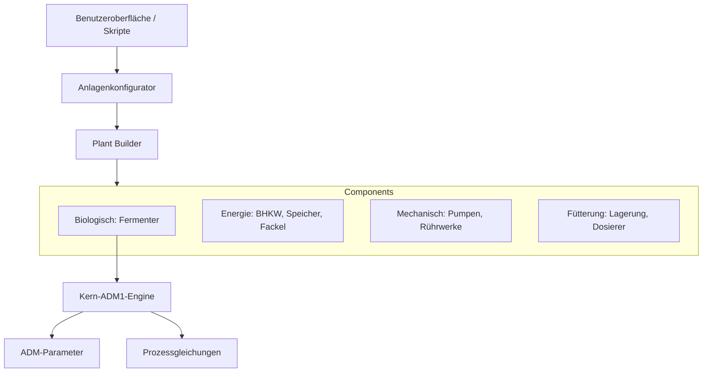
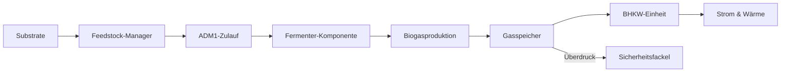
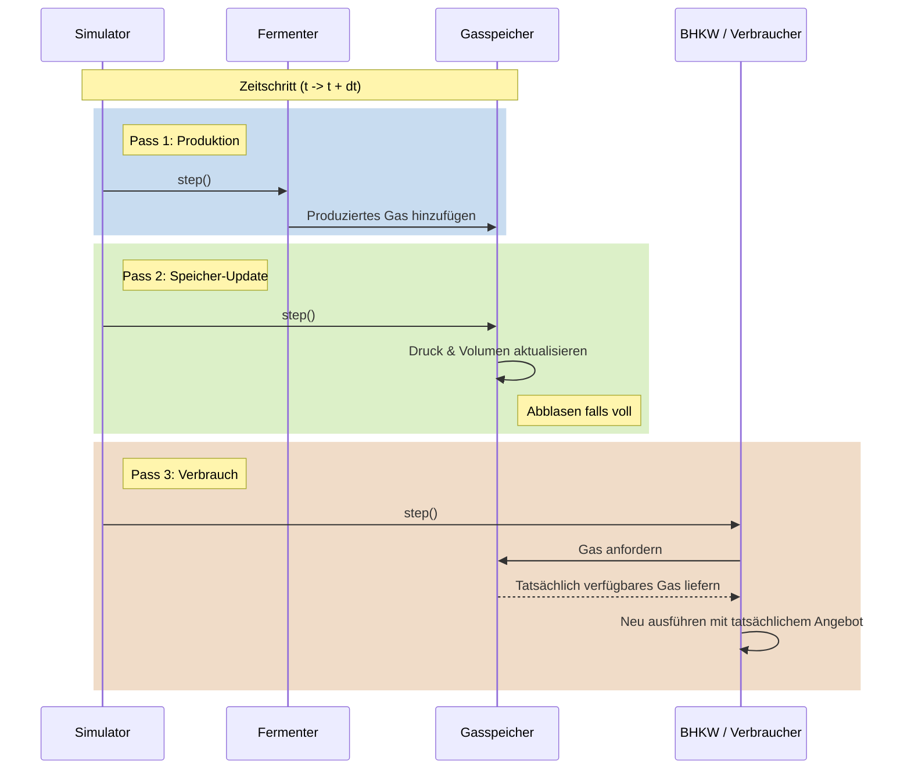

# Architektur

Diese Seite beschreibt die Systemarchitektur und den Datenfluss von PyADM1ODE.

## Systemübersicht

Das Framework besteht aus mehreren modularen Schichten:

## Datenfluss

## Drei-Pass-Simulationsprozess

Um Gasflussabhängigkeiten korrekt zu behandeln, verwendet die Simulation ein Drei-Pass-Modell für jeden Zeitschritt:

