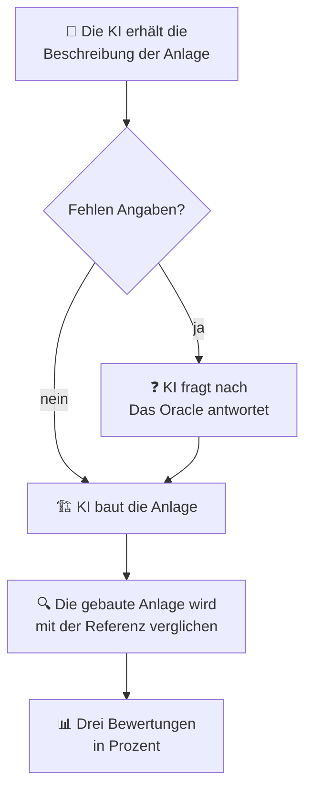

# Bewertung & Ablauf

Diese Seite erklärt, **wie ein Test abläuft** und **wie die Bewertung entsteht**.

## Der Ablauf eines Tests

Schritt für Schritt:

1. **Aufgabe lesen:** Die KI erhält die Beschreibung (Text oder Skizze).
2. **Nachfragen (nur bei unvollständigen Aufgaben):** Fehlt etwas, darf die KI das
   [Oracle](datenpunkt.md) fragen.
3. **Anlage bauen:** Die KI generiert den Python-Code, mit dem PyADM1ODE die Anlage aufbaut.
4. **Vergleichen:** Die so gebaute Anlage wird mit der **Referenz** (der richtigen
   Anlage) verglichen.
5. **Bewerten:** Daraus entstehen drei Bewertungen in Prozent.

## Die drei Bewertungen

Das Ergebnis wird aus drei Blickwinkeln betrachtet. Jede Bewertung ist ein
Prozentwert zwischen 0 % und 100 %.

-   :material-graph-outline:{ .lg .middle } **1. Struktur**

    ---

    Sind die **richtigen Bauteile** vorhanden und **richtig verbunden**?
    Beispiel: Fließt der Gärrest vom Fermenter in den Nachgärer und das Biogas
    zum Blockheizkraftwerk?

-   :material-ruler:{ .lg .middle } **2. Maße**

    ---

    Stimmen die **Größen und Werte** – etwa Volumen, Temperatur oder die Leistung
    des Blockheizkraftwerks? Geprüft wird mit einem **Toleranzbereich**, kleine
    Abweichungen sind also erlaubt.

-   :material-help-circle-outline:{ .lg .middle } **3. Lücken**

    ---

    Ist die KI mit **fehlenden Angaben** richtig umgegangen? Hat sie **nachgefragt**
    oder **plausibel ergänzt**, statt einfach einen falschen Wert zu erfinden?

## Was zählt – und was nicht

Damit die Bewertung fair und aussagekräftig bleibt, werden einige Dinge bewusst
**nicht** mitgewertet:

- **Namen sind egal:** Die KI darf Bauteile anders benennen. Verglichen wird nach
  **Art** des Bauteils (Fermenter, Pumpe …), nicht nach dem Namen.
- **Substrate werden nicht bewertet:** Welche Stoffe gefüttert werden, fließt nicht
  in die Wertung ein, es geht allein um den **Aufbau** der Anlage.
- **Schwerster Fehler:** Einen unplausiblen Wert **still zu erfinden**, statt
  nachzufragen, wird am stärksten abgewertet.

## Hinweis zu Skizzen-Aufgaben

Aufgaben mit **Skizze** (Bild) können nur von KI-Modellen gelöst werden, die
**Bilder verstehen**. Ein reines Text-Modell kann eine Skizze nicht „sehen" und
würde solche Aufgaben zwangsläufig mit 0 % bewertet bekommen.
