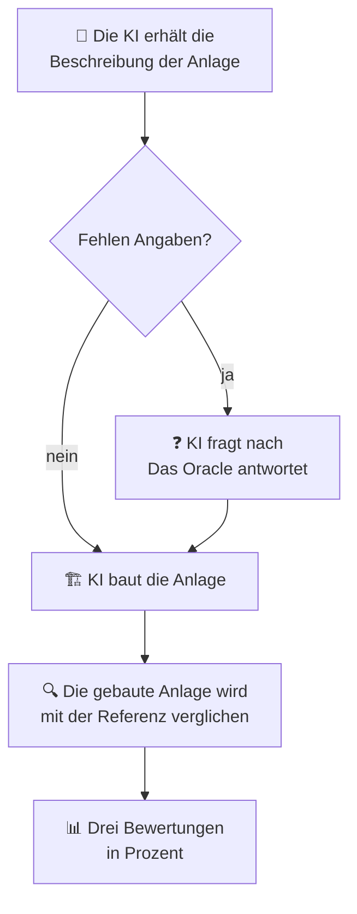

# Bewertung & Ablauf

Diese Seite erklärt, **wie ein Test abläuft** und **wie die Bewertung entsteht**.

## Der Ablauf eines Tests

```mermaid
flowchart TB
    A["📝 Die KI erhält die<br>Beschreibung der Anlage"] --> B{Fehlen Angaben?}
    B -- "ja" --> C["❓ KI fragt nach<br> Das Oracle antwortet"]
    B -- "nein" --> D["🏗️ KI baut die Anlage"]
    C --> D
    D --> E["🔍 Die gebaute Anlage wird<br>mit der Referenz verglichen"]
    E --> F["📊 Drei Bewertungen<br>in Prozent"]
```

Schritt für Schritt:

1. **Aufgabe lesen:** Die KI erhält die Beschreibung (Text, Skizze oder PDF).  
2. **Nachfragen (nur bei unvollständigen Aufgaben):** Fehlt etwas, darf die KI das  
   [Oracle](datenpunkt.md) fragen.  
3. **Anlage bauen:** Die KI generiert den Python-Code, mit dem PyADM1ODE die Anlage aufbaut.  
4. **Vergleichen:** Die so gebaute Anlage wird mit der **Referenz** (der richtigen  
   Anlage) verglichen.  
5. **Bewerten:** Daraus entstehen drei Bewertungen in Prozent.  

## Die drei Bewertungen

Das Ergebnis wird aus drei Blickwinkeln betrachtet. Jede Bewertung ist ein
Prozentwert zwischen 0 % und 100 %. Die drei Blickwinkel sind bewusst so gewählt,
dass sich **jeder mögliche Fehler genau einer** Bewertung zuordnen lässt.

-   :material-playlist-check:{ .lg .middle } **1. Vollständigkeit**  

    ---

    Ist **alles Nötige da**? Fehlt ein Behälter, ein Blockheizkraftwerk oder eine
    Leitung zwischen zwei Bauteilen, sinkt diese Bewertung.

-   :material-ruler:{ .lg .middle } **2. Maße**  

    ---

    Stimmen die **Größen und Werte** – etwa Volumen, Temperatur oder die Leistung
    des Blockheizkraftwerks? Geprüft wird mit einem **Toleranzbereich**, kleine
    Abweichungen sind also erlaubt.

-   :material-alert-octagon-outline:{ .lg .middle } **3. Keine Erfindungen**  

    ---

    Ist **nur** das da, was auch dazugehört? Baut die KI ein zusätzliches Bauteil
    oder eine Leitung ein, die es gar nicht gibt, sinkt diese Bewertung.

!!! info "Wie eng ist der Toleranzbereich?"
    Jede Angabe, die für die Simulation gebraucht wird, **steht entweder in der
    Beschreibung oder die KI kann sie erfragen**. Raten muss sie nie. Entsprechend eng
    ist der Bereich — er deckt nur ab, was beim Rechnen unvermeidlich ist:

    - **Wird der Wert übernommen** (aus der Beschreibung oder vom Oracle), muss die KI  
      ihn treffen. Erlaubt ist nur Rundung: `40 °C` als `313,0` statt `313,15 K` ist in
      Ordnung, `39 °C` nicht.  
    - **Wird der Wert gerechnet** — etwa ein Volumen aus Durchmesser und Höhe —, darf  
      etwas mehr abweichen. Je nachdem, wo man rundet, kommt man auf leicht
      unterschiedliche Ergebnisse.

## Jeder Fehler zählt genau einmal

| Was die KI falsch macht | Welche Bewertung sinkt |
| --- | --- |
| lässt ein Bauteil oder eine Leitung **weg** | 1. Vollständigkeit |
| **erfindet einen Wert**, der nicht plausibel ist | 2. Maße |
| **erfindet ein Bauteil** oder eine Leitung | 3. Keine Erfindungen |

Erfindet die KI ein Bauteil einer Art, die es in der Anlage **überhaupt nicht gibt**
– etwa einen Separator in einer Anlage ganz ohne Separator –, wird die dritte
Bewertung besonders hart gedeckelt. Das ist der schwerste Fehler.

Weglassen lohnt sich dabei nicht: Wer ein Bauteil nicht baut, wird auch dessen
Leitungen nicht los – sie fehlen dann ebenfalls.

## Was zählt – und was nicht

Damit die Bewertung fair und aussagekräftig bleibt, werden einige Dinge bewusst
**nicht** mitgewertet:

- **Namen sind egal:** Die KI darf Bauteile anders benennen. Verglichen wird nach  
  **Art** des Bauteils (Fermenter, Pumpe …), nicht nach dem Namen.  
- **Substrate werden nicht bewertet:** Welche Stoffe gefüttert werden, fließt nicht  
  in die Wertung ein, es geht allein um den **Aufbau** der Anlage.  
- **Rückfragen werden nicht benotet:** Ob die KI nachfragt, ist ihr überlassen.  
  Bewertet wird nur die Anlage, die am Ende dabei herauskommt — wer rät und daneben
  liegt, verliert bei den **Maßen**.

## Hinweis zu Skizzen- und PDF-Aufgaben

Aufgaben mit **Skizze** (Bild) können nur von KI-Modellen gelöst werden, die
**Bilder verstehen**. Ein reines Text-Modell kann eine Skizze nicht „sehen" und
würde solche Aufgaben zwangsläufig mit 0 % bewertet bekommen.

**PDF-Aufgaben** brauchen das nicht: Aus dem Dokument wird der Text ausgelesen und
als Text weitergereicht. Auch ein reines Text-Modell kann sie also lösen. Die
Schwierigkeit liegt woanders — die technischen Angaben stehen zwischen
Positionsnummern, Preisen und Zahlungsbedingungen und müssen erst herausgesucht
werden.
