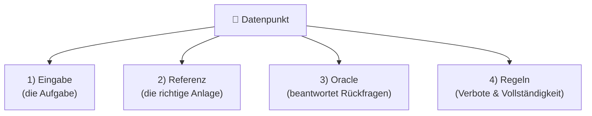

# Ein Datenpunkt im Detail

Ein **Datenpunkt** ist **eine einzelne Aufgabe** für die KI. Er enthält alles, was
für diese Aufgabe gebraucht wird: die Beschreibung der Anlage, die richtige Lösung
zum Vergleich und einige Zusatzangaben für eine faire Bewertung.

## Die vier wichtigsten Bestandteile



### 1. Die Eingabe

Das ist die **Beschreibung der Anlage**, die die KI zu sehen bekommt. Je nach
Variante ist das ein ausführlicher Text, ein knapper Text oder eine Skizze (Bild).
Die KI bekommt **nur** diese Eingabe, sonst nichts.

### 2. Die Referenz

Die Referenz beschreibt, **wie die Anlage richtig aussieht**. An ihr wird das Ergebnis
der KI gemessen. Sie besteht aus zwei Listen:

- **Bauteile:** alle Behälter und Geräte (z. B. Fermenter, Nachgärer, Gärrestlager,
  Blockheizkraftwerk) mit ihren Eckdaten wie Größe und Temperatur.
- **Verbindungen:** wer mit wem verbunden ist, also den Weg des Gärrests und
 des Biogases durch die Anlage.

!!! example "So sieht eine Anlage als Bauteile + Verbindungen aus (BGA2)"
    ```mermaid
    flowchart LR
        F1["Fermenter F1"] -->|Gärrest| N1["Nachgärer N1"]
        N1 -->|Gärrest| G1["Gärrestlager G1"]
        F1 -.Biogas.-> BHKW["Blockheizkraftwerk"]
        N1 -.Biogas.-> BHKW
        G1 -.Biogas.-> BHKW
    ```

### 3. Das Oracle

Manche Beschreibungen sind absichtlich **unvollständig**, genau wie in der
Praxis, wo nicht immer alle Angaben vorliegen. Für solche Fälle gibt es das
**Oracle**: einen Experten, den die KI bei Unklarheiten **gezielt befragen** kann.

Fragt die KI zum Beispiel „Bei welcher Temperatur läuft der Fermenter?", liefert das Oracle die passende Antwort, etwa „40 °C". Dabei erkennt es auch **unterschiedliche Formulierungen** für dieselbe Frage.

!!! tip "Warum gibt es das Oracle?"
    Es soll zwei Verhaltensweisen unterscheiden: Eine gute KI **fragt nach**, wenn
    eine Angabe fehlt. Eine schlechtere KI **rät einfach** und liegt möglicherweise
    daneben.

### 4. Die Regeln

Zwei Zusatzangaben sorgen für eine faire Bewertung:

- **Vollständigkeit** – gibt an, ob die Aufgabe **vollständig** oder **unvollständig**
  beschrieben ist:

    - *vollständig spezifiziert*: Alle Angaben stehen in der Beschreibung. Kein
      Nachfragen nötig.
    - *unvollständig spezifiziert*: Es fehlen Angaben, die erfragt oder sinnvoll
      ergänzt werden müssen.

- **Verbote** – Dinge, die die KI **nicht erfinden** darf. Hat eine Anlage
 z. B. kein Blockheizkraftwerk, darf die KI auch keines hinzufügen.

## Wie „sicher" eine Angabe ist

Nicht jede Angabe ist gleich eindeutig. Deshalb ist bei jeder Eigenschaft
hinterlegt, **woher** sie kommt:

| Einstufung           | Bedeutung                                                        |
| -------------------- | ---------------------------------------------------------------- |
| **gegeben**          | Steht direkt in der Beschreibung.                                |
| **ableitbar**        | Lässt sich aus anderen Angaben berechnen (z. B. ein Volumen aus Höhe und Durchmesser). |
| **erfragbar** | Fehlt in der Beschreibung. Die KI sollte nachfragen oder die Angabe sinnvoll ergänzen.      |
| **automatisch**      | Entsteht beim Aufbau von selbst, zum Beispiel ein Gasspeicher für jeden Fermenter. |

Das ermöglicht eine faire Bewertung: Eine fehlende Angabe darf die KI ergänzen,
ohne dass es als Fehler zählt, solange die Ergänzung plausibel ist.

Wie aus all diesen Angaben am Ende eine **Bewertung** wird, erklärt die nächste
Seite: [Bewertung & Ablauf](bewertung.md).
