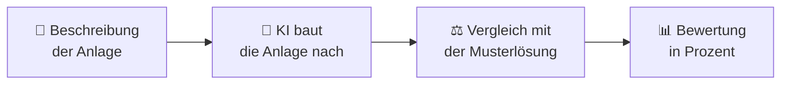

# Benchmark-Datensatz

Der Benchmark-Datensatz ist eine Sammlung von **beschriebenen Biogasanlagen**.
Mit ihm wird getestet, wie gut eine **künstliche Intelligenz (KI)** aus der
Beschreibung einer Anlage ein lauffähiges Modell für PyADM1ODE „nachbauen" kann.

## Worum geht es?

PyADM1ODE ist eine Software, die Biogasanlagen simulieren kann. Damit die Software
eine **bestimmte** Anlage rechnet, muss man ihr diese Anlage zuerst beschreiben:
Wie viele Behälter gibt es? Wie groß sind sie? Wie sind sie miteinander verbunden?
Gibt es ein Blockheizkraftwerk?

Die KI bekommt eine Beschreibung und erzeugt daraus die Anlage. Als Eingabe kann
ein Text dienen, eine Zeichnung der Anlagenstruktur oder eine Kombination aus beidem.
Anschließend wird ihr Ergebnis mit einer bekannten **Musterlösung** verglichen.

## So geht es weiter

-   :material-folder-multiple:{ .lg .middle } **Aufbau des Datensatzes**  

    ---

    Welche Anlagen gibt es, und wie sind die Aufgaben organisiert?

    [:octicons-arrow-right-24: Aufbau des Datensatzes](aufbau.md)

-   :material-file-document-outline:{ .lg .middle } **Ein Datenpunkt im Detail**  

    ---

    Was genau steckt in einer einzelnen Aufgabe?

    [:octicons-arrow-right-24: Ein Datenpunkt im Detail](datenpunkt.md)

-   :material-crystal-ball:{ .lg .middle } **Wie funktioniert das Oracle?**  

    ---

    Wie die KI bei fehlenden Werten nachfragen darf – und wie das Oracle antwortet.

    [:octicons-arrow-right-24: Wie funktioniert das Oracle?](oracle.md)

-   :material-scale-balance:{ .lg .middle } **Bewertung & Ablauf**  

    ---

    Wie läuft ein Test ab, und wie entsteht die Bewertung?

    [:octicons-arrow-right-24: Bewertung & Ablauf](bewertung.md)

