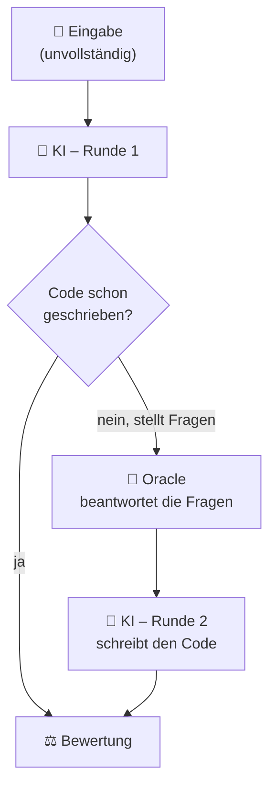

# Wie funktioniert das Oracle?

Manche Anlagenbeschreibungen sind absichtlich **unvollständig**, wo nicht immer
alle Angaben vorliegen. Damit die KI trotzdem weiterarbeiten kann, gibt es das
**Oracle**: einen simulierten Experten, den die KI bei Unklarheiten **gezielt befragen** darf.
Diese Seite erklärt, **wann** das Oracle aktiv ist, **wie** eine Frage zu einer Antwort wird
und **warum** das für eine faire Bewertung wichtig ist.

Eine erste Einordnung steht unter [Ein Datenpunkt im Detail](datenpunkt.md); hier
geht es um die Mechanik dahinter.

## Wann ist das Oracle aktiv?

Das Oracle wird **nur** bei unvollständig beschriebenen Aufgaben befragt:

- **vollständig spezifiziert** (`fully_specified`): Alle Angaben stehen in der
  Beschreibung. Es gibt nichts zu fragen, das Oracle bleibt stumm.
- **unvollständig spezifiziert** (`underspecified`): Werte fehlen. Erst hier darf die
  KI Rückfragen stellen und nur dann antwortet das Oracle.

!!! info "Grundlage: das `oracle`-Feld"
    Jeder Datenpunkt trägt ein `oracle`-Feld, ein Verzeichnis aus **Feldname →
    Wert**. Es ist die einzige Wissensquelle des Experten. Beispiel (gekürzt):

    ```json
    "oracle": {
      "F1.T_ad": 313.15,
      "G1.T_ad": 293.15,
      "F1.fill_fraction": 0.9,
      "bgaa.exists": true,
      "chp.exists": false,
      "sep.source": "N1",
      "substrate_feed": "ca. 80 t/d Maissilage und 20 m³/d Rindergülle"
    }
    ```

## Der Ablauf in zwei Runden



1. **Runde 1:** Die KI erhält die Beschreibung. Bei unvollständigen Aufgaben darf sie
   ihre offenen Fragen als kleinen JSON-Block ausgeben, statt sofort zu raten:

    ```json
    { "open_questions": [{ "field": "F1.T_ad" }, { "field": "sep.source" }] }
    ```

2. **Oracle:** Stellt die KI Fragen, schlägt das Oracle
   die passenden Werte im `oracle`-Feld nach und schickt sie als Antwort zurück.
3. **Runde 2:** Mit den Antworten schreibt die KI den vollständigen PyADM1ODE-Code,
   der anschließend bewertet wird.

Schreibt die KI bereits in Runde 1 fertigen Code, entfällt die Oracle-Runde. Pro
Datenpunkt gibt es **höchstens eine** Oracle-Runde.

## Wie aus einer Frage eine Antwort wird

Das Oracle versteht **unterschiedliche Formulierungen** derselben Frage. Es muss
nicht das interne Feld `F1.T_ad` getroffen werden, es genügt „Bei welcher Temperatur läuft der
Fermenter?". Die Zuordnung läuft in mehreren Stufen, von der genauesten zur
großzügigsten:

| Stufe | Was passiert | Beispiel |
| ----- | ------------ | -------- |
| **1. Exakter Treffer** | Die Frage nennt den Feldnamen direkt. | `F1.T_ad` → `313.15` |
| **2. Schlüsselwörter** | Synonyme werden auf eine Größe abgebildet. | „Temperatur", „beheizt", „mesophil" → alle `*.T_ad` |
| **3. Bauteil-Kürzel** | Eine genannte Komponente liefert alle ihre Felder. | „F1" → `F1.T_ad`, `F1.V_gas`, `F1.fill_fraction` |
| **4. Wörtliche Felder** | Im Frage­text auftauchende Feldnamen werden ergänzt. | „… `bgaa.capacity_m3h` …" |

Die Schlüsselwort-Tabelle ist **zwei­sprachig** (Deutsch und Englisch) und deckt
typische Begriffe ab, etwa „Gasspeicher"/„gas storage" für `V_gas`,
„Füllgrad"/„fill level" für `fill_fraction`, „Nennleistung"/„rated power" für
`P_el_nom` oder „Substrat"/„feedstock" für `substrate_feed`. Begriffe wie
„Wirkungsgrad" liefern bewusst **beide** zugehörigen Felder (`eta_el` und `eta_th`).

!!! example "Frage → Oracle-Antwort"
    Frage der KI:

    ```json
    { "open_questions": [{ "field": "Betriebstemperatur der Fermenter" }] }
    ```

    Antwort des Oracle:

    ```text
    Antworten auf deine Fragen:

    - F1.T_ad: 313.15
    - F2.T_ad: 313.15
    - N1.T_ad: 313.15
    - G1.T_ad: 293.15

    Bitte schreibe nun den vollständigen Python-Code.
    ```

### Hilfreich, aber nicht allwissend

Das Oracle ist bewusst **kooperativ**:

- **Keine passende Frage erkannt?** Dann gibt es lieber **alle** verfügbaren Angaben
  heraus, statt die KI im Stich zu lassen.
- **Nur wenig gefragt?** Hat die KI nur einen kleinen Teil erfragt und bleiben
  höchstens fünf weitere Felder offen, ergänzt das Oracle diese als „Weitere relevante
  Informationen". So scheitert ein Lauf nicht an einer einzelnen vergessenen Frage.

## Warum es das Oracle gibt

Das Oracle trennt zwei Verhaltensweisen, die ohne es ununterscheidbar wären:

- Eine **gute KI fragt nach**, wenn eine Angabe fehlt und baut die Anlage danach
  korrekt.
- Eine **schwächere KI rät** und erfindet möglicherweise einen unplausiblen Wert.

Genau das schlägt sich in der Bewertung nieder: Für unvollständige Datenpunkte zählt
der **Lücken-Score**, ob ein fehlendes Feld **erfragt** oder plausibel im
Akzeptanzband **ergänzt** wurde. Das **stille Erfinden** eines unplausiblen Werts ist
der schwerste Fehler. Details dazu auf der Seite
[Bewertung & Ablauf](bewertung.md).

!!! tip "`response.json` – Fragen und Annahmen festhalten"
    Wer ein eigenes Modell **offline** auswertet, macht erfragte und ergänzte Felder
    in einer `response.json` neben dem Code explizit:

    ```json
    {
      "open_questions": [{ "field": "sep.source" }],
      "assumptions":    [{ "field": "F1.T_ad", "value": 313.15 }]
    }
    ```

    Mehr dazu unter [Datensatz nutzen](nutzung.md).

## Oracle abschalten

Zum Vergleich lässt sich das Oracle deaktivieren. Dann stellt die KI **keine**
Rückfragen und muss fehlende Werte selbst plausibel annehmen oder mit Standardwerten
arbeiten:

```bash
python benchmark/eval/solve.py --no-oracle
```

Das zeigt, wie gut ein Modell **ohne** Hilfestellung mit Lücken umgeht, eine nützliche
Gegenprobe zum regulären Lauf mit Oracle.

---

Den Datensatz visuell erkunden – inklusive der erwarteten Rückfragen und der
Oracle-Antworten pro Datenpunkt – kannst du im [Viewer](viewer.md).
