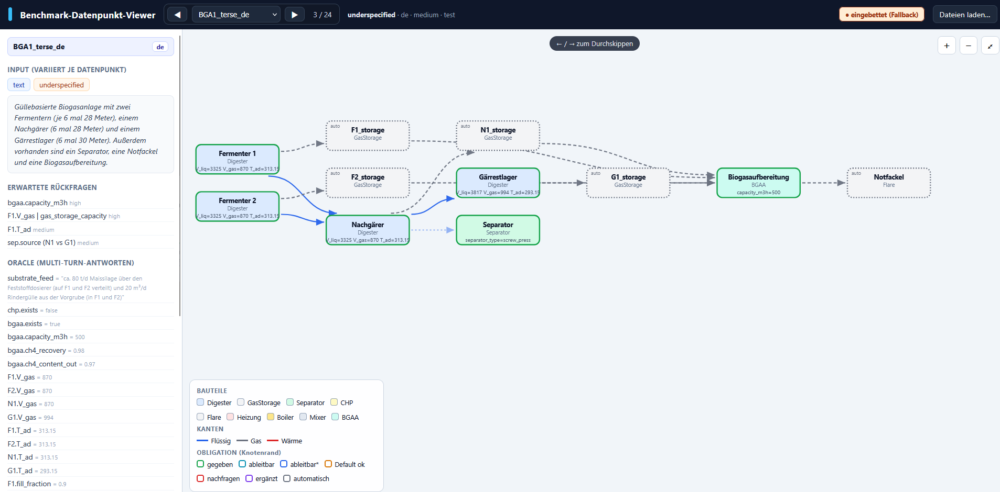

# Datenpunkt-Viewer

Der **Viewer** (`benchmark/viewer/index.html`) zeigt jeden Datenpunkt
**interaktiv** (die Eingabe, die Oracle-Antworten, Metadaten und die Parameter
jedes Bauteils). Ideal, um den Datensatz zu erkunden, eine Anlage zu verstehen.
Er läuft **offline im Browser**, ganz ohne Server.



## Was der Viewer zeigt

- **Anlagengraph**: Bauteile als Knoten, Verbindungen als Kanten.  
- **Bauteil-Details**: Tabelle der simulierten Parameter, Akzeptanzband und Hinweisen.  
- **Seitenleiste**: die **Eingabe**, die **erwarteten Rückfragen**, die **Oracle-Antworten**, die  
  **„nicht erfinden"**-Verbote, die **verworfenen** (nicht simulierten) Teile und die **Metadaten**.

## Legende (Graph)

| Element | Bedeutung |
| ------- | --------- |
| **Knotenfarbe** | Bauteiltyp (Digester, GasStorage, CHP, Flare, …) |
| **Kantenfarbe / -stil** | Verbindungstyp: Flüssig · Gas · Wärme |
| **Knotenrand** | `obligation` des Bauteils (gegeben / ableitbar / erfragbar / automatisch) |

Die Legende unten links im Viewer fasst die Farbcodierung zusammen.

## Starten

Sie können den Viewer **offline** ausführen, jedoch werden neue Änderungen am Datensatz
dann nicht angezeigt. Alternativ aktualisieren Sie die Index-Datei oder starten einen
**lokalen Server**, um die Änderungen direkt im Viewer zu sehen.

### Offline

Ein Doppelklick auf `benchmark/viewer/index.html` öffnet den Viewer direkt
(`file://`). Er zeigt dann eine **eingebettete Kopie** der Datenpunkte. Über
**Dateien laden…** lassen sich beliebige Datenpunkt-JSONs manuell öffnen.

### Live-Modus

Zeigt immer den aktuellen Datensatz; Änderungen sind nach einem Reload sichtbar.

```bash
python -m http.server 8000              # einfacher lokaler Server
```

Dann im Browser öffnen: <http://localhost:8000/benchmark/viewer/>

## Bedienung

| Aktion | Bedienelement |
| ------ | ------------- |
| Zum vorherigen / nächsten Datenpunkt | Buttons **◀ / ▶** oder Pfeiltasten **←/→** |
| Bauteil-Details anzeigen | Klick auf einen Knoten im Graph |
| Zoomen | Buttons **+ / − / ⤢** oder Mausrad |
| Eigene Datenpunkte öffnen | **Dateien laden…** (eine oder mehrere `.json`) |

## Nach Änderungen am Datensatz

Wurden Datenpunkte hinzugefügt oder geändert, den Index neu erzeugen:

```bash
python benchmark/eval/make_index.py
```

Mehr zum Datensatz und den Auswerteskripten steht unter
[Datensatz nutzen](nutzung.md).
