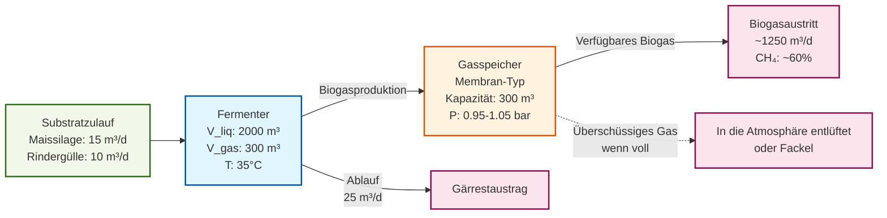

# Basis-Fermenter Beispiel

[](https://colab.research.google.com/github/dgaida/PyADM1ODE/blob/master/examples/colab_01_basic_digester.ipynb)


Das Beispiel [examples/01_basic_digester.py](https://github.com/dgaida/PyADM1ODE/blob/master/examples/01_basic_digester.py) zeigt die einfachstmögliche PyADM1-Konfiguration: einen einzelnen Fermenter mit Substratzulauf und integriertem Gasspeicher.

## Systemarchitektur



## Übersicht

Das Basis-Fermenter-Beispiel zeigt:  
- Laden von Substratdaten (Feedstock-Management)  
- Erstellen einer einstufigen Biogasanlage  
- Automatische Gasspeicher-Erstellung pro Fermenter  
- Initialisierung aus einer Steady-State-CSV-Datei  
- Durchführen einer kurzen Simulation (5 Tage)  
- Extrahieren und Anzeigen wichtiger Prozessindikatoren  

## Anlagenkonfiguration

Die Anlage besteht aus:  
- **1 Fermenter** (2000 m³ Flüssigkeitsvolumen, 300 m³ Gasvolumen)  
- **1 Gasspeicher** (automatisch erstellt, am Fermenter angeschlossen)  
- **Substratzulauf**: Maissilage (15 m³/d) + Rindergülle (10 m³/d)  

**Wichtiger Punkt**: Der Gasspeicher wird automatisch durch `PlantConfigurator.add_digester()` erstellt und mit dem Fermenter verbunden. Dies gewährleistet eine realistische Gaspufferung und Druckmanagement.

## Code-Durchgang

### 1. Setup und Imports

```python
from pyadm1.configurator.plant_builder import BiogasPlant
from pyadm1.substrates.feedstock import Feedstock
from pyadm1.core.adm1 import get_state_zero_from_initial_state
from pyadm1.configurator.plant_configurator import PlantConfigurator
```

Die wichtigsten Imports sind:  
- `BiogasPlant`: Container für alle Anlagenkomponenten  
- `Feedstock`: Verwaltet Substrateigenschaften und Mischungen  
- `PlantConfigurator`: High-Level-Helper zum Hinzufügen von Komponenten (verwaltet automatisch Gasspeicher)  
- `get_state_zero_from_initial_state`: Lädt den Initialzustand aus einer CSV-Datei  

### 2. Feedstock erstellen

```python
feeding_freq = 48  # Substrat kann alle 48 Stunden geändert werden
feedstock = Feedstock(feeding_freq=feeding_freq)
```

Das Feedstock-Objekt lädt Substratparameter aus [`substrate_gummersbach.xml`](https://github.com/dgaida/PyADM1ODE/blob/master/data/substrates/substrate_gummersbach.xml) und verwaltet:  
- Substratzusammensetzung (Weender-Analyse)  
- ADM1-Parameterberechnung  
- Generierung des Zulaufstroms  

**Fütterungsfrequenz**: Der Parameter `feeding_freq` (48 Stunden) definiert, wie oft die Steuerung den Substratzulauf anpassen kann. Dies ist wichtig für Optimierungs- und Regelungsanwendungen.

### 3. Initialzustand laden

```python
initial_state_file = data_path / "digester_initial8.csv"
adm1_state = get_state_zero_from_initial_state(str(initial_state_file))
```

Die CSV-Datei für den Initialzustand enthält 37 ADM1-Zustandsvariablen, die einen stabilen Zustand (Steady State) repräsentieren. Dies vermeidet lange Einschwingzeiten, in denen das Modell von unrealistischen Startwerten übergeht.

**ADM1-Zustandsvektor** (37 Variablen):  
- Gelöste Stoffe (0-11): S_su, S_aa, S_fa, S_va, S_bu, S_pro, S_ac, S_h2, S_ch4, S_co2, S_nh4, S_I  
- Partikuläre Stoffe (12-24): X_xc, X_ch, X_pr, X_li, X_su, X_aa, X_fa, X_c4, X_pro, X_ac, X_h2, X_I, X_p  
- Ionen (25-32): S_cation, S_anion, S_va_ion, S_bu_ion, S_pro_ion, S_ac_ion, S_hco3_ion, S_nh3  
- Gasphase (33-36): pi_Sh2, pi_Sch4, pi_Sco2, pTOTAL  

### 4. Substratzulauf definieren

```python
Q_substrates = [15, 10, 0, 0, 0, 0, 0, 0, 0, 0]  # Maissilage und Gülle
```

Der Zulaufvektor `Q_substrates` gibt die volumetrischen Durchflussraten [m³/d] für jedes in der XML-Datei definierte Substrat an. In diesem Beispiel:  
- Substrat 1 (Maissilage): 15 m³/d  
- Substrat 2 (Rindergülle): 10 m³/d  
- Substrate 3-10: Nicht verwendet (0 m³/d)  

**Hydraulische Verweilzeit (HRT)**: 25 m³/d ÷ 2000 m³ = **0,0125 d⁻¹** oder **HRT ≈ 80 Tage**

### 5. Anlage mit PlantConfigurator bauen

```python
plant = BiogasPlant("Quickstart Anlage")
configurator = PlantConfigurator(plant, feedstock)

configurator.add_digester(
    digester_id="main_digester",
    V_liq=2000.0,
    V_gas=300.0,
    T_ad=308.15,  # 35°C mesophil
    name="Hauptfermenter",
    load_initial_state=True,
    initial_state_file=str(initial_state_file),
    Q_substrates=Q_substrates,
)
```

**PlantConfigurator** bietet eine High-Level-API, die:  
- **Automatisch einen Gasspeicher erstellt und an jeden Fermenter anschließt**  
- Die Initialisierung mit ordnungsgemäßer Fehlerprüfung handhabt  
- Komponentenparameter validiert  
- Verbindungen zwischen Komponenten verwaltet  

Der Gasspeicher wird erstellt mit:  
- **Typ**: Membranspeicher (Niederdruck, typisch für Biogas)  
- **Kapazität**: Basierend auf dem V_gas Parameter (300 m³)  
- **Druckbereich**: 0.95-1.05 bar (typischer Membranspeicher)  
- **Anfangsfüllung**: 10 % der Kapazität  

**Design-Parameter**:  
- `V_liq=2000.0`: Flüssigkeitsvolumen [m³] - typisch für eine mittelgroße landwirtschaftliche Anlage  
- `V_gas=300.0`: Gasraum [m³] - etwa 15 % des Flüssigkeitsvolumens  
- `T_ad=308.15`: Betriebstemperatur [K] = 35°C (mesophiler Bereich)  

### 6. Initialisieren und Simulieren

```python
plant.initialize()

results = plant.simulate(
    duration=5.0,        # 5 Tage
    dt=1.0 / 24.0,      # Zeitschritt von 1 Stunde
    save_interval=1.0    # Ergebnisse täglich speichern
)
```

**Simulations-Parameter**:  
- `duration`: Gesamte Simulationszeit [Tage]  
- `dt`: Integrationszeitschritt [Tage]. 1 Stunde (1/24 Tag) ist Standard für ADM1  
- `save_interval`: Wie oft Ergebnisse gespeichert werden [Tage]. Tägliches Speichern reduziert den Speicherverbrauch  

**Hinweis**: Der Simulator verwendet einen BDF (Backward Differentiation Formula) Solver, der für steife ODEs wie ADM1 optimiert ist.

**Drei-Pass-Gasfluss-Simulation**:  
1. **Pass 1**: Fermenter produziert Biogas → Gasspeicher empfängt es  
2. **Pass 2**: Gasspeicher aktualisiert den internen Zustand (Druck, Volumen)  
3. **Pass 3**: Gas steht für nachgeschaltete Verbraucher (BHKWs etc.) zur Verfügung  

### 7. Ergebnisse anzeigen

```python
for result in results:
    comp_results = result["components"]["main_digester"]
    print(f"Tag {time:.1f}:")
    print(f"  Biogas:  {comp_results.get('Q_gas', 0):>8.1f} m³/d")
    print(f"  Methan: {comp_results.get('Q_ch4', 0):>8.1f} m³/d")
    print(f"  pH:      {comp_results.get('pH', 0):>8.2f}")
    print(f"  VFA:     {comp_results.get('VFA', 0):>8.2f} g/L")
    print(f"  TAC:     {comp_results.get('TAC', 0):>8.2f} g/L")
```

**Wichtige Prozessindikatoren**:  
- **Q_gas**: Gesamtbiogasproduktion [m³/d]  
- **Q_ch4**: Methanproduktion [m³/d]  
- **pH**: Prozess-pH-Wert (optimal: 6,8-7,5)  
- **VFA**: Flüchtige Fettsäuren [g HAc-eq/L] (optimal: <3 g/L)  
- **TAC**: Gesamte Alkalinität [g CaCO₃-eq/L] (optimal: >6 g/L)  

**Gasspeicher-Indikatoren** (in den Fermenter-Ergebnissen enthalten):  
- **stored_volume_m3**: Aktuelles Gasvolumen im Speicher [m³]  
- **pressure_bar**: Aktueller Speicherdruck [bar]  
- **vented_volume_m3**: In diesem Zeitschritt abgeblasenes Gas [m³]  
- **Q_gas_supplied_m3_per_day**: Gas, das für Verbraucher verfügbar ist [m³/d]  

## Erwartete Ausgabe

Das Ausführen dieses Beispiels erzeugt eine Ausgabe wie:

```
======================================================================
PyADM1 Schnellstart-Beispiel (PlantConfigurator Version)
======================================================================

1. Feedstock wird erstellt...
2. Initialzustand wird aus CSV geladen...
   Laden von: digester_initial8.csv
3. Biogasanlage wird erstellt...
4. Fermenter wird mit PlantConfigurator hinzugefügt...
   - Fermenter 'main_digester' erstellt
   - Gasspeicher 'main_digester_storage' automatisch erstellt
   - Initialzustand: Geladen aus digester_initial8.csv
5. Anlage wird initialisiert...
6. Simulation wird gestartet...
   Dauer: 5 Tage
   Zeitschritt: 1 Stunde
   Speicherintervall: 1 Tag

======================================================================
SIMULATIONSERGEBNISSE
======================================================================

6 tägliche Ergebnis-Snapshots generiert

Tag 0.0:
  Biogas:   1245.3 m³/d
  Methan:   748.2 m³/d
  pH:          7.28
  VFA:         2.34 g/L
  TAC:         8.45 g/L
  Speicher:
    - Volumen: 30.0 m³ (10% voll)
    - Druck: 0.97 bar
    - Abgeblasen: 0.0 m³

Tag 1.0:
  Biogas:   1248.7 m³/d
  Methan:   750.1 m³/d
  pH:          7.29
  VFA:         2.32 g/L
  TAC:         8.47 g/L
  Speicher:
    - Volumen: 82.3 m³ (27% voll)
    - Druck: 1.01 bar
    - Abgeblasen: 0.0 m³

...

======================================================================
ABSCHLUSSZUSAMMENFASSUNG
======================================================================
Gesamtbiogasproduktion:  1251.4 m³/d
Gesamtmethanproduktion: 751.9 m³/d
Methangehalt:          60.1%
Prozessstabilität (pH):   7.30
Speicherauslastung:  35%
======================================================================

✅ Simulation erfolgreich abgeschlossen!

💾 Konfiguration gespeichert unter: output/quickstart_config.json
```

## Prozessinterpretation

### Typische Leistungsmetriken

Für diese Konfiguration (25 m³/d Zulauf, HRT ≈ 80 Tage):

| Metrik | Wert | Bewertung |
|--------|-------|------------|
| Biogasproduktion | ~1250 m³/d | Gut |
| Methangehalt | ~60 % | Typisch für landwirtschaftliche Substrate |
| Spezifischer Gasertrag | ~50 m³/m³ Zulauf | Gut für Mix aus Maissilage + Gülle |
| pH-Wert | 7,28-7,30 | Optimal (stabil) |
| VFA | 2,3-2,4 g/L | Gut (weit unter dem Limit von 3 g/L) |
| TAC | 8,4-8,5 g CaCO₃/L | Exzellente Pufferkapazität |
| FOS/TAC | ~0,27 | Stabiler Prozess (< 0,3) |

### Prozessstabilitätsindikatoren

**pH-Stabilität**: Der pH-Wert bleibt bei ca. 7,3, was auf Folgendes hindeutet:  
- Gute Pufferkapazität (hoher TAC)  
- Ausgeglichene VFA-Produktion und -Verbrauch  
- Kein Risiko einer Versäuerung  

**VFA/TAC-Gleichgewicht**: Ein VFA-Wert von 2,3 g/L bei einem TAC-Wert von 8,4 g/L ergibt einen FOS/TAC ≈ 0,27:  
- < 0,3: Stabiler Prozess  
- 0,3-0,4: Genau beobachten  
- > 0,4: Gefahr der Versäuerung  

**Methangehalt**: 60 % CH₄ ist typisch für:  
- Energiepflanzen (Maissilage)  
- Tierische Exkremente  
- Mesophile Vergärung  

## Gasspeicher-Verhalten

Der automatisch erstellte Gasspeicher:  
- **Typ**: Niederdruck-Membranspeicher  
- **Kapazität**: ~300 m³ (basierend auf V_gas)  
- **Druckbereich**: 0,95-1,05 bar  
- **Funktion**: Puffert Schwankungen in der Gasproduktion  
- **Sicherheit**: Lässt überschüssiges Gas bei Vollfüllung ab, um Überdruck zu vermeiden  

**Speicherdynamik**:
```python
'gas_storage': {
    'stored_volume_m3': 150.0,      # Aktuelles Gasvolumen
    'pressure_bar': 1.01,            # Aktueller Druck
    'vented_volume_m3': 0.0,         # In diesem Zeitschritt abgeblasen
    'utilization': 0.50,             # 50 % gefüllt
    'Q_gas_supplied_m3_per_day': 1250.0  # Verfügbar für Verbraucher
}
```

**Wenn der Speicher voll ist**:  
- Der Druck steigt von 0,95 auf 1,05 bar  
- Bei 1,05 bar (volle Kapazität) wird überschüssiges Gas abgeblasen  
- Das Abblasen verhindert Überdruck und Schäden an der Ausrüstung  
- In realen Anlagen wird das abgeblasene Gas zur Sicherheitsverbrennung an eine Fackel geleitet  

## Konfigurationsexport

Die Anlagenkonfiguration wird im JSON-Format gespeichert:

```json
{
  "plant_name": "Quickstart Anlage",
  "simulation_time": 5.0,
  "components": [
    {
      "component_id": "main_digester",
      "component_type": "digester",
      "V_liq": 2000.0,
      "V_gas": 300.0,
      "T_ad": 308.15,
      "state": {...}
    },
    {
      "component_id": "main_digester_storage",
      "component_type": "storage",
      "storage_type": "membrane",
      "capacity_m3": 300.0,
      "p_min_bar": 0.95,
      "p_max_bar": 1.05
    }
  ],
  "connections": [
    {
      "from": "main_digester",
      "to": "main_digester_storage",
      "type": "gas"
    }
  ]
}
```

Diese JSON-Datei kann neu geladen werden, um den exakten Anlagenzustand wiederherzustellen:

```python
plant = BiogasPlant.from_json("output/quickstart_config.json", feedstock)
```

## Nächste Schritte

Nachdem Sie dieses Basisbeispiel ausgeführt haben:

1. **Parameter variieren**:  
   - Passen Sie die Substratzulaufraten in `Q_substrates` an  
   - Ändern Sie die Fermentertemperatur `T_ad`  
   - Ändern Sie das Fermentervolumen `V_liq`  

2. **Simulationsdauer verlängern**:  
   ```python
   results = plant.simulate(duration=30.0, dt=1.0/24.0)
   ```

3. **Energiekomponenten hinzufügen**:  
   Siehe [`two_stage_plant.md`](two_stage_plant.md) für die Integration von BHKW und Heizung

4. **Steuerung implementieren**:  
   Verwenden Sie `Simulator.determine_best_feed_by_n_sims()` zur Optimierung

## Häufige Probleme

### Problem: "Initialzustandsdatei nicht gefunden"

**Lösung**: Stellen Sie sicher, dass `data/initial_states/digester_initial8.csv` existiert, oder setzen Sie `load_initial_state=False`:

```python
configurator.add_digester(
    digester_id="main_digester",
    V_liq=2000.0,
    load_initial_state=False,  # Standard-Initialisierung verwenden
    Q_substrates=Q_substrates,
)
```

### Problem: Niedrige Biogasproduktion

**Ursachen**:  
- HRT zu kurz (V_liq erhöhen oder Q_substrates reduzieren)  
- Substratzulauf zu niedrig (Werte in Q_substrates erhöhen)  
- Temperatur zu niedrig (T_ad erhöhen)  

**Beispiel-Fix**:
```python
Q_substrates = [20, 15, 0, 0, 0, 0, 0, 0, 0, 0]  # Zulauf erhöhen
```

### Problem: Prozessinstabilität (pH-Abfall)

**Ursachen**:  
- Organische Überlastung (Q_substrates reduzieren)  
- Unzureichende Pufferkapazität  

**Beispiel-Fix**:
```python
# Puffer-Substrat hinzufügen (z. B. Kalk bei Index 7)
Q_substrates = [15, 10, 0, 0, 0, 0, 0, 1, 0, 0]  # 1 m³/d Kalk
```

### Problem: Überdruckwarnungen im Gasspeicher

**Symptome**:  
- Häufige Meldungen über Gasabblasungen  
- Speicher permanent auf maximalem Druck  

**Lösungen**:
```python
# Gasspeicherkapazität erhöhen
configurator.add_digester(
    digester_id="main_digester",
    V_liq=2000.0,
    V_gas=500.0,  # Erhöht von 300
    Q_substrates=Q_substrates,
)
```

## Referenzen

- **ADM1-Modell**: Batstone et al. (2002). *Anaerobic Digestion Model No. 1*. IWA Publishing.  
- **PyADM1**: Sadrimajd et al. (2021). *PyADM1: a Python implementation of ADM1*. bioRxiv.  
- **Substratcharakterisierung**: Gaida (2014). *Dynamic real-time substrate feed optimization of anaerobic co-digestion plants*. PhD thesis, Leiden University.  
- **Leitfaden Biogas**: FNR (2016). https://mediathek.fnr.de/leitfaden-biogas.html  

## Ähnliche Beispiele

- [`two_stage_plant.md`](two_stage_plant.md): Zweistufige Vergärung mit BHKW und Heizung  
- `calibration_workflow.md`: Parameterschätzung aus Messdaten  
- `substrate_optimization.py`: Optimale Fütterungsstrategie  
- [`parallel_two_stage_simulation.py`](https://github.com/dgaida/PyADM1ODE/blob/master/examples/parallel_two_stage_simulation.py): Parallele Simulationen  
