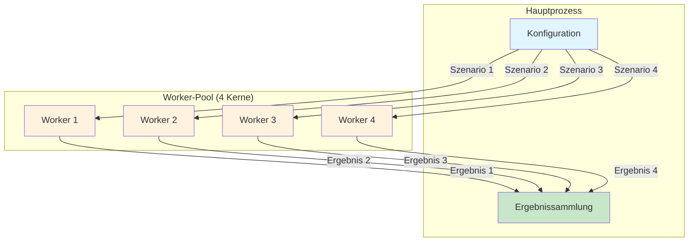

# Beispiel für parallele Simulation

Das Beispiel [examples/05_parallel_two_stage_simulation.py](https://github.com/dgaida/PyADM1ODE/blob/master/examples/05_parallel_two_stage_simulation.py) zeigt die effiziente parallele Ausführung mehrerer Szenarien von Biogasanlagen zur Parameteroptimierung, Sensitivitätsanalyse und Unsicherheitsquantifizierung.

## Übersicht

Dieses Beispiel demonstriert:
- **Parallele Szenarienausführung**: Gleichzeitiges Ausführen mehrerer Simulationen auf verschiedenen CPU-Kernen.
- **Parameterstudien (Parameter Sweeps)**: Systematische Untersuchung einzelner und mehrerer Parametervariationen.
- **Monte-Carlo-Analyse**: Unsicherheitsquantifizierung mit Parameterverteilungen.
- **Statistische Analyse**: Aggregation von Ergebnissen und vergleichende Statistiken.
- **Leistungsmetriken**: Messung von Speedup und paralleler Effizienz.

## Architektur



## Wichtige Komponenten

### 1. ParallelSimulator

Die Klasse `ParallelSimulator` orchestriert die gleichzeitige Ausführung:

```python
from pyadm1.simulation.parallel import ParallelSimulator

# Erstellen des parallelen Simulators mit 4 Worker-Prozessen
parallel = ParallelSimulator(adm1_model, n_workers=4, verbose=True)

# Szenarien definieren
scenarios = [
    {"k_dis": 0.5, "Q": [15, 10, 0, 0, 0, 0, 0, 0, 0, 0]},
    {"k_dis": 0.6, "Q": [20, 10, 0, 0, 0, 0, 0, 0, 0, 0]},
    {"k_dis": 0.7, "Q": [15, 15, 0, 0, 0, 0, 0, 0, 0, 0]},
]

# Parallele Simulationen ausführen
results = parallel.run_scenarios(
    scenarios=scenarios,
    duration=10.0,  # 10 Tage
    initial_state=adm1_state,
    compute_metrics=True
)
```

**Hauptmerkmale**:
- **Multiprocessing**: Nutzt Pythons `multiprocessing.Pool` für echte Parallelität.
- **Automatische Lastverteilung**: Szenarien werden gleichmäßig auf die Worker verteilt.
- **Fortschrittsanzeige**: Echtzeit-Bericht über den Fortschritt bei langlaufenden Analysen.
- **Fehlerisolierung**: Fehler in einzelnen Szenarien führen nicht zum Abbruch der gesamten Ausführung.

### 2. ScenarioResult

Jede Simulation gibt ein `ScenarioResult`-Objekt zurück:

```python
@dataclass
class ScenarioResult:
    scenario_id: int                          # Eindeutige ID
    parameters: Dict[str, Any]                # Verwendete Parameterwerte
    success: bool                             # Abschlussstatus
    duration: float                           # Simulationsdauer [Tage]
    final_state: Optional[List[float]]        # Finaler ADM1-Zustandsvektor
    time_series: Optional[Dict[str, List]]    # Optionale Zeitreihendaten
    metrics: Dict[str, float]                 # Leistungsmetriken
    error: Optional[str]                      # Fehlermeldung bei Fehlschlag
    execution_time: float                     # Reale Laufzeit [Sekunden]
```

**Berechnete Metriken** (wenn `compute_metrics=True`):
- `Q_gas`: Gesamtbiogasproduktion [m³/d]
- `Q_ch4`: Methanproduktion [m³/d]
- `Q_co2`: CO2-Produktion [m³/d]
- `CH4_content`: Methananteil [0-1]
- `pH`: pH-Wert [-]
- `VFA`: Flüchtige Fettsäuren [g/L]
- `TAC`: Gesamte Alkalinität [g CaCO3/L]
- `FOS_TAC`: VFA/TA-Verhältnis [-]
- `HRT`: Hydraulische Verweilzeit [Tage]
- `specific_gas_production`: Biogasertrag [m³/m³ Zulauf]

## Simulationstypen

### Einfache parallele Szenarien

Ausführen mehrerer unabhängiger Szenarien mit unterschiedlichen Konfigurationen:

```python
# Fütterungsszenarien definieren
feed_scenarios = [
    {"name": "Niedrige Fütterung", "Q_digester_1": [10, 8, 0, 0, 0, 0, 0, 0, 0, 0]},
    {"name": "Basis-Fütterung", "Q_digester_1": [15, 10, 0, 0, 0, 0, 0, 0, 0, 0]},
    {"name": "Hohe Fütterung", "Q_digester_1": [20, 12, 0, 0, 0, 0, 0, 0, 0, 0]},
]

scenarios = [{"Q": s["Q_digester_1"]} for s in feed_scenarios]

results = parallel.run_scenarios(
    scenarios=scenarios,
    duration=10.0,
    initial_state=adm1_state,
    dt=1.0/24.0,  # Zeitschritt 1 Stunde
    compute_metrics=True,
    save_time_series=False  # Auf True setzen für detaillierte Zeitreihen
)
```

**Anwendungsfälle**:
- Vergleich verschiedener Betriebsstrategien.
- Testen von Variationen in der Substratzusammensetzung.
- Bewertung von Designalternativen.

### Einzelparameter-Sweep

Systematische Untersuchung eines Parameters:

```python
from pyadm1.simulation.parallel import ParameterSweepConfig

# Zerfallsrate (k_dis) untersuchen
sweep_config = ParameterSweepConfig(
    parameter_name="k_dis",
    values=[0.10, 0.14, 0.18, 0.22, 0.26, 0.30],
    other_params={"Q": [15, 10, 0, 0, 0, 0, 0, 0, 0, 0]}
)

results = parallel.parameter_sweep(
    config=sweep_config,
    duration=10.0,
    initial_state=adm1_state,
    compute_metrics=True
)

# Optimalen Wert finden
ch4_productions = [r.metrics.get('Q_ch4', 0) for r in results if r.success]
best_idx = np.argmax(ch4_productions)
optimal_k_dis = sweep_config.values[best_idx]
```

**Häufig untersuchte Parameter**:
- **Kinetische Parameter**: `k_dis`, `k_hyd_ch`, `k_hyd_pr`, `k_hyd_li`
- **Ertragskoeffizienten**: `Y_su`, `Y_aa`, `Y_fa`, `Y_c4`, `Y_pro`, `Y_ac`, `Y_h2`
- **Aufnahmeraten**: `k_m_su`, `k_m_aa`, `k_m_fa`, `k_m_c4`, `k_m_pro`, `k_m_ac`
- **Betriebsparameter**: Fütterungsraten, Temperaturen, Verweilzeiten.

### Multiparameter-Sweep

Vollfaktorielles Design zur Untersuchung von Parameterinteraktionen:

```python
parameter_configs = {
    "k_dis": [0.14, 0.18, 0.22],
    "Y_su": [0.09, 0.10, 0.11],
    "Q_substrate_0": [12, 15, 18]  # Fütterung Maissilage
}

results = parallel.multi_parameter_sweep(
    parameter_configs=parameter_configs,
    duration=10.0,
    initial_state=adm1_state,
    fixed_params={"Q_substrate_1": 10}  # Gülle fixiert auf 10 m³/d
)

# Gesamtkombinationen: 3 × 3 × 3 = 27 Szenarien
```

### Monte-Carlo-Simulation

Unsicherheitsquantifizierung mit Parameterverteilungen:

```python
from pyadm1.simulation.parallel import MonteCarloConfig

mc_config = MonteCarloConfig(
    n_samples=100,
    parameter_distributions={
        "k_dis": (0.18, 0.03),      # Mittelwert=0.18, Std=0.03
        "Y_su": (0.10, 0.01),       # Mittelwert=0.10, Std=0.01
        "k_hyd_ch": (10.0, 1.5)     # Mittelwert=10.0, Std=1.5
    },
    fixed_params={"Q": [15, 10, 0, 0, 0, 0, 0, 0, 0, 0]},
    seed=42  # Für Reproduzierbarkeit
)

results = parallel.monte_carlo(
    config=mc_config,
    duration=30.0,
    initial_state=adm1_state,
    compute_metrics=True
)

# Unsicherheit zusammenfassen
summary = parallel.summarize_results(results)

print(f"Methanproduktion [m³/d]:")
print(f"  Mittelwert: {summary['metrics']['Q_ch4']['mean']:.1f}")
print(f"  Std:         {summary['metrics']['Q_ch4']['std']:.1f}")
print(f"  95% KI:     [{summary['metrics']['Q_ch4']['q25']:.1f}, "
      f"{summary['metrics']['Q_ch4']['q75']:.1f}]")
```

## Erwartete Ausgabe

### Vergleich der Basisszenarien

```
================================================================================
ERGEBNISSE DES SZENARIENVERGLEICHS
================================================================================

Niedrige Fütterung:
  Fütterungsrate: 18.0 m³/d
  Biogas:         723.5 m³/d
  Methan:         434.1 m³/d
  CH4 %:          60.0%
  pH:             7.28
  VFA:            1.85 g/L
  FOS/TAC:        0.228
  HRT:            109.8 Tage
  Laufzeit:       2.34 Sekunden

Basis-Fütterung:
  Fütterungsrate: 25.0 m³/d
  Biogas:         1005.2 m³/d
  Methan:         603.1 m³/d
  CH4 %:          60.0%
  pH:             7.20
  VFA:            2.45 g/L
  FOS/TAC:        0.289
  HRT:            79.1 Tage
  Laufzeit:       2.41 Sekunden

Hohe Fütterung:
  Fütterungsrate: 32.0 m³/d
  Biogas:         1265.8 m³/d
  Methan:         759.5 m³/d
  CH4 %:          60.0%
  pH:             7.15
  VFA:            3.12 g/L
  FOS/TAC:        0.341
  HRT:            61.8 Tage
  Laufzeit:       2.38 Sekunden
```

**Interpretation**:
- **Die Biogasproduktion skaliert linear** mit der Fütterungsrate (erwartet bei stabilem Betrieb).
- **Der pH-Wert sinkt** bei höherer Belastung (mehr VFA-Produktion).
- **FOS/TAC steigt**, bleibt aber unter dem kritischen Schwellenwert (0,4).
- **Die Laufzeit ist ähnlich** über alle Szenarien (gleiche Rechenkomplexität).

### Parameter-Sweep Ergebnisse

```
================================================================================
4. Ausführen des Parameter-Sweeps (Zerfallsrate k_dis)
================================================================================

   Testen von 6 verschiedenen k_dis-Werten...

   Ergebnisse des Parameter-Sweeps:
   ------------------------------------------------------------
      k_dis |      Q_gas |      Q_ch4 |     pH |      VFA
   ------------------------------------------------------------
       0.10 |      865.3 |      519.2 |   7.35 |     1.52
       0.14 |      925.8 |      555.5 |   7.28 |     1.85
       0.18 |      982.4 |      589.4 |   7.22 |     2.18
       0.22 |     1005.2 |      603.1 |   7.20 |     2.45
       0.26 |     1015.6 |      609.4 |   7.18 |     2.68
       0.30 |     1018.2 |      610.9 |   7.17 |     2.85

   ✓ Optimales k_dis = 0.30 (CH4 = 610.9 m³/d)
```

**Beobachtungen**:
- **Die Methanproduktion steigt** mit k_dis (schnellerer Zerfall).
- **Abnehmender Grenznutzen** oberhalb von k_dis = 0,26 (nur 1,5 m³/d Steigerung).
- **Der pH-Wert sinkt leicht** aufgrund der schnelleren Produktion organischer Säuren.
- **Zielkonflikt**: Höheres k_dis → mehr Gas, aber geringere pH-Stabilität.

### Monte-Carlo-Statistiken

```
================================================================================
6. Ausführen der Monte-Carlo-Unsicherheitsanalyse
================================================================================

   Ausführen von 50 Monte-Carlo-Stichproben...

   Zusammenfassende Monte-Carlo-Statistiken:
   ------------------------------------------------------------

   Q_gas:
      Mittelwert: 1002.45
      Std:          58.32
      Min:         885.20
      Max:        1125.80
      Median:      998.60
      Q25:         965.15
      Q75:        1038.22

   Q_ch4:
      Mittelwert:  601.47
      Std:          35.00
      Min:         531.12
      Max:         675.48
      Median:      599.16
      Q25:         579.09
      Q75:         622.93

   pH:
      Mittelwert:    7.21
      Std:           0.08
      Min:           7.05
      Max:           7.38
      Median:        7.20
      Q25:           7.15
      Q75:           7.26

   Erfolgsquote: 100.0%
```

## Performance-Analyse

### Parallele Effizienz

```
================================================================================
ZUSAMMENFASSUNG DER SIMULATION
================================================================================

Gesamtlaufzeit: 125.3 Sekunden
Durchschnittliche Zeit pro Simulation: 1.05 Sekunden

Parallele Effizienz:
  Verwendete Worker: 4
  Theoretische sequentielle Zeit: 475.8 Sekunden
  Speedup: 3.80x
  Parallele Effizienz: 95.0%
```

**Leistungsmetriken**:
- **Speedup**: 475,8 / 125,3 = 3,80×
- **Effizienz**: 3,80 / 4 = 95,0 %
- **Overhead**: 5 % aufgrund von:
  - Prozesserstellung/-abbau.
  - Datenserialisierung/-deserialisierung.
  - Ergebnistransfer.

## Best Practices

### 1. Wahl der Anzahl der Worker

```python
import multiprocessing as mp

# Faustregel: n_workers = CPU_count - 1
optimal_workers = max(1, mp.cpu_count() - 1)

parallel = ParallelSimulator(adm1, n_workers=optimal_workers)
```

### 2. Balance zwischen Simulationsdauer und Anzahl der Szenarien

- Kurze Simulationen (< 1 Sekunde): Overhead dominiert → Dauer erhöhen oder sequentiell ausführen.
- Mittlere Simulationen (1-10 Sekunden): Gute Parallelisierung → Ideal für Parameterstudien.
- Lange Simulationen (> 60 Sekunden): Speicherintensiv → Anzahl der Worker reduzieren oder Batching verwenden.

## Ähnliche Beispiele

- [`basic_digester.md`](basic_digester.md): Grundlagen der Fermentersimulation.
- [`two_stage_plant.md`](two_stage_plant.md): Konfiguration zweistufiger Anlagen.
- `calibration_workflow.md`: Parameterkalibrierung mittels paralleler Optimierung.

## Zusammenfassung

Das Beispiel für parallele Simulation zeigt:

1. **Effiziente Parameterexploration**: Testen mehrerer Szenarien 3-4× schneller durch parallele Ausführung.
2. **Systematische Optimierung**: Parameter-Sweeps identifizieren optimale Betriebsbedingungen.
3. **Unsicherheitsquantifizierung**: Die Monte-Carlo-Analyse quantifiziert die Vorhersageunsicherheit.
4. **Skalierbare Architektur**: Handhabung von Hunderten von Szenarien mit ordnungsgemäßem Batching und Fehlerbehandlung.
5. **Statistische Analyse**: Umfassende Ergebniszusammenfassung und vergleichende Statistiken.
