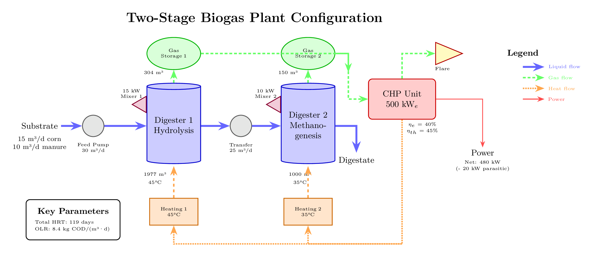
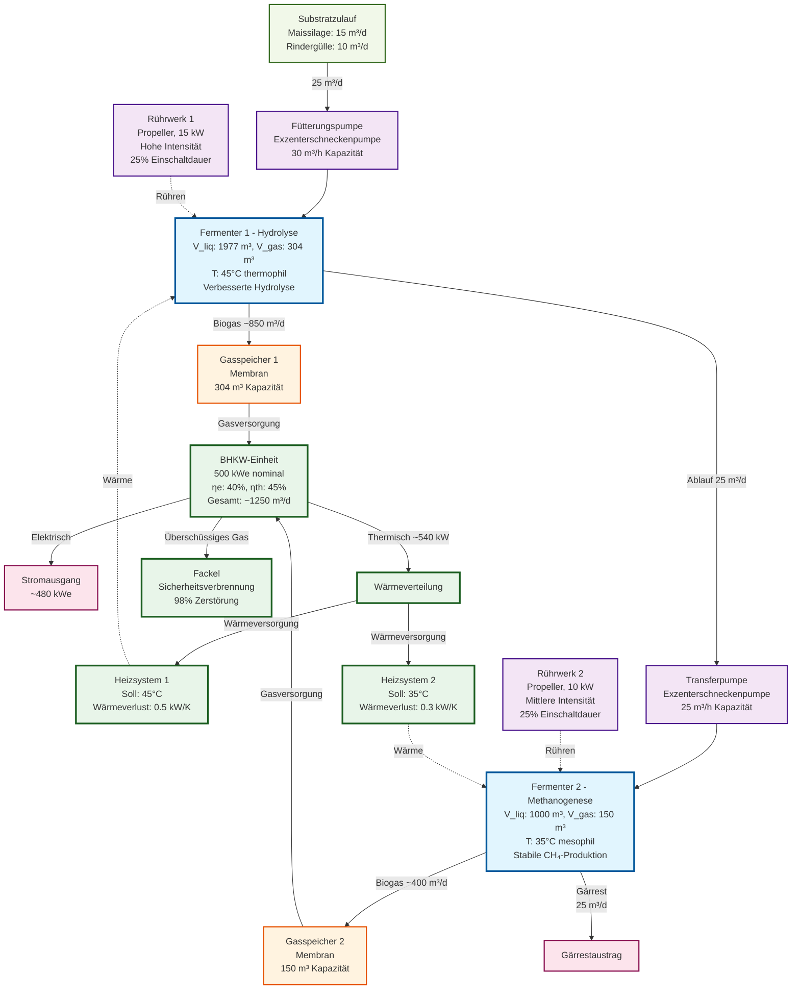

# Zweistufige Biogasanlage Beispiel

Das Beispiel [examples/02_two_stage_plant.py](https://github.com/dgaida/PyADM1ODE/blob/master/examples/02_two_stage_plant.py) zeigt eine komplette zweistufige Biogasanlage mit mechanischen Komponenten, Energieintegration und umfassender Prozessüberwachung.

## Anlagenschema



## Systemarchitektur



## Übersicht

Die zweistufige Anlage demonstriert:
- **Temperature-Phased Anaerobic Digestion (TPAD)**: Thermophile Hydrolyse (45°C) gefolgt von mesophiler Methanogenese (35°C)
- **Mechanische Komponenten**: Pumpen für den Materialtransport und Rührwerke zur Prozessunterstützung
- **Energieintegration**: BHKW zur Stromerzeugung und Abwärmenutzung
- **Prozesssteuerung**: Mehrere Heizsysteme für ein präzises Temperaturmanagement
- **Gasmanagement**: Dedizierter Speicher für jeden Fermenter mit automatischem Überlaufschutz und zentraler Fackel

## Anlagenkonfiguration

### Biologische Komponenten

| Komponente | Volumen | Temperatur | Funktion | HRT |
|------------|---------|------------|----------|-----|
| **Fermenter 1** | 1977 m³ liq + 304 m³ gas | 45°C (thermophil) | Hydrolyse komplexer Organik | 79 Tage |
| **Fermenter 2** | 1000 m³ liq + 150 m³ gas | 35°C (mesophil) | Methanogenese (CH₄-Produktion) | 40 Tage |
| **Gesamt** | 2977 m³ | - | - | 119 Tage |

**Gesamte organische Raumbelastung (OLR)**: 25 m³/d ÷ 2977 m³ ≈ **0,0084 d⁻¹** oder **8,4 kg CSB/(m³·d)**

### Mechanische Komponenten

| Komponente | Typ | Kapazität | Leistung | Funktion |
|------------|-----|-----------|----------|----------|
| **Fütterungspumpe** | Exzenterschnecke | 30 m³/h | ~5 kW | Substratfütterung in Fermenter 1 |
| **Transferpumpe** | Exzenterschnecke | 25 m³/h | ~8 kW | Ablauf-Transfer: F1 → F2 |
| **Rührwerk 1** | Propeller | 15 kW | 15 kW | Hochintensive Durchmischung für Hydrolyse |
| **Rührwerk 2** | Propeller | 10 kW | 10 kW | Mittlere Durchmischung für Methanogenese |

**Gesamter Eigenverbrauch**: ~20 kW (Rührwerke laufen mit 25 % Einschaltdauer)

### Energiekomponenten

| Komponente | Spezifikation | Wirkungsgrad | Leistung |
|------------|---------------|--------------|----------|
| **BHKW-Einheit** | 500 kW$ nominal | η$ = 40 %, ηcat{th}$ = 45 % | 500 kW$ + 562 kWcat{th}$ |
| **Heizung 1** | Fermenter 1 Heizung | - | Hält 45°C |
| **Heizung 2** | Fermenter 2 Heizung | - | Hält 35°C |
| **Fackel** | Sicherheitsverbrennung | 98 % Zerstörung | Entsorgung von Überschussgas |

### Gasmanagement-System

| Komponente | Typ | Kapazität | Funktion |
|------------|-----|-----------|----------|
| **Speicher 1** | Membran | 304 m³ | Puffer für Gas aus Fermenter 1 |
| **Speicher 2** | Membran | 150 m³ | Puffer für Gas aus Fermenter 2 |
| **BHKW-Fackel** | Verbrennung | Variabel | Sicherheitsentsorgung von Überschussgas |

**Gasfluss-Architektur**:
1. Jeder Fermenter produziert Gas → Dedizierter Speicher
2. Beide Speicher liefern Gas → Einzelne BHKW-Einheit
3. BHKW-Überschuss/Überlauf → Automatische Fackelverbrennung

## Code-Durchgang

### 1. Erweiterte Imports

```python
from pyadm1.components.mechanical.mixer import Mixer
from pyadm1.components.mechanical.pump import Pump
```

Diese importieren die mechanischen Komponenten, die im Basisbeispiel nicht verwendet wurden.

### 2. Zweistufige Fermenter-Konfiguration

```python
# Fermenter 1: Thermophile Hydrolyse
configurator.add_digester(
    digester_id="digester_1",
    V_liq=1977.0,
    V_gas=304.0,
    T_ad=318.15,  # 45°C für verbesserte Hydrolyse
    Q_substrates=[15, 10, 0, 0, 0, 0, 0, 0, 0, 0],
)

# Fermenter 2: Mesophile Methanogenese
configurator.add_digester(
    digester_id="digester_2",
    V_liq=1000.0,
    V_gas=150.0,
    T_ad=308.15,  # 35°C optimal für Methanogene
    Q_substrates=[0, 0, 0, 0, 0, 0, 0, 0, 0, 0],  # Empfängt nur Ablauf
)
```

**Design-Überlegungen**:
- **Stufe 1 (thermophil)**: Höhere Temperaturen verbessern die Hydrolyse komplexer Substrate (Zellulose, Hemizellulose, Proteine).
- **Stufe 2 (mesophil)**: Niedrigere Temperaturen sind stabiler und effizienter für die Methanogenese.
- **Nur Ablauf-Fütterung für Stufe 2**: Verhindert Überlastung, erhält vorhydrolysiertes Material.

**Automatische Gasspeicher-Erstellung**:
- `add_digester()` erstellt automatisch:
  - `digester_1_storage` (304 m³ Membranspeicher)
  - `digester_2_storage` (150 m³ Membranspeicher)
- Die Speicher werden automatisch mit ihren Fermentern verbunden.

### 3. Mechanische Komponenten hinzufügen

#### Fütterungspumpe
```python
feed_pump = Pump(
    component_id="feed_pump",
    pump_type="progressive_cavity",  # Handhabt dicke Suspensionen
    Q_nom=30.0,  # m³/h nominal
    pressure_head=5.0,  # Niedriger Druck
)
```

**Exzenterschneckenpumpen** sind ideal für Biogassubstrate, weil sie:
- Hohe Feststoffgehalte (>12 % TS) bewältigen
- Scherkräfte minimieren (Faserstruktur bleibt erhalten)
- Selbstansaugend sind
- Einen weiten Viskositätsbereich abdecken

#### Transferpumpe
```python
transfer_pump = Pump(
    component_id="transfer_pump",
    pump_type="progressive_cavity",
    Q_nom=25.0,  # m³/h
    pressure_head=8.0,  # Höherer Druck für Transfer zwischen Fermentern
)
```

Höherer Druck erforderlich für:
- Überwindung von Rohrreibungslasten
- Höhenunterschiede
- Injektion in unter Druck stehenden Fermenter

#### Rührwerke
```python
mixer_1 = Mixer(
    component_id="mixer_1",
    mixer_type="propeller",
    tank_volume=1977.0,
    mixing_intensity="high",  # Aggressiv für Hydrolyse
    power_installed=15.0,
    intermittent=True,
    on_time_fraction=0.25,  # 6 Stunden an, 18 Stunden aus
)
```

**Rührstrategie**:
- **Intermittierender Betrieb**: Reduziert den Energieverbrauch um 75 %.
- **Hohe Intensität in der Hydrolyse**: Aufbrechen von Schwimmschichten, verbessert den Substratkontakt.
- **Mittlere Intensität in der Methanogenese**: Schonendes Rühren verhindert die Hemmung empfindlicher Methanogener.

**Spezifischer Leistungseintrag**:
- Fermenter 1: 15 kW × 0,25 ÷ 1977 m³ = **1,9 W/m³** (hoch)
- Fermenter 2: 10 kW × 0,25 ÷ 1000 m³ = **2,5 W/m³** (mittel)

### 4. Energieintegration mit automatischer Fackel

```python
# BHKW hinzufügen (erstellt automatisch Fackel)
configurator.add_chp(
    chp_id="chp_1",
    P_el_nom=500.0,
    eta_el=0.40,
    eta_th=0.45,
    name="Haupt-BHKW",
)

# Automatische Verbindungen handhaben das Gas-Routing
configurator.auto_connect_digester_to_chp("digester_1", "chp_1")
configurator.auto_connect_digester_to_chp("digester_2", "chp_1")

# Wärmerückgewinnung für beide Fermenter
configurator.auto_connect_chp_to_heating("chp_1", "heating_1")
configurator.auto_connect_chp_to_heating("chp_1", "heating_2")
```

**Verbindungskette**:
```
Fermenter 1 → Speicher 1 ↘
                          → BHKW → Fackel (automatisch)
Fermenter 2 → Speicher 2 ↗      ↓
                          Wärme → Heizung 1 & 2
```

**Automatische Fackelerstellung**:
- `add_chp()` erstellt automatisch eine Fackelkomponente.
- Fackel-ID: `{chp_id}_flare` (z. B. "chp_1_flare")
- Funktion: Sicherheitsverbrennung von Überschussgas (98 % CH₄-Zerstörung)
- Automatische Verbindung: BHKW → Fackel

### 5. Drei-Pass-Gasfluss-Simulation

Die Simulation erfolgt in drei Durchgängen für ein realistisches Gasmanagement:

**Pass 1 - Gasproduktion**:
```python
# Fermenter produzieren Gas → Speichertanks
Fermenter 1: Q_gas = 850 m³/d → Speicher 1
Fermenter 2: Q_gas = 400 m³/d → Speicher 2
```

**Pass 2 - Speicher-Aktualisierung**:
```python
# Speicher empfangen Gas, aktualisieren Druck und Volumen
Speicher 1: gespeichertes_volumen += 850 * dt
Speicher 2: gespeichertes_volumen += 400 * dt
# Wenn voll: Überschuss an die Atmosphäre ablassen
```

**Pass 3 - Gasverbrauch**:
```python
# BHKW fordert Gas von den Speichern an
BHKW-Bedarf: 1150 m³/d Biogas
Speicher 1 liefert: ~675 m³/d
Speicher 2 liefert: ~475 m³/d
# BHKW arbeitet mit tatsächlichem Angebot
# Überschuss zur Fackel: (Angebot - Verbrauch)
```

Dies gewährleistet:
- Realistisches Druckmanagement in Speichern
- BHKW arbeitet mit verfügbarem Gas, nicht mit idealisiertem Angebot
- Automatisches Abblasen verhindert Überdruck
- Die Fackel handhabt das gesamte Überschussgas sicher

## Erwartete Ausgabe

### Anlagenzusammenfassung
```
=== Zweistufige Anlage mit mechanischen Komponenten ===
Simulationszeit: 0.00 Tage

Komponenten (12):
  - Hydrolyse-Fermenter (digester)
  - Hydrolyse-Fermenter Gasspeicher (storage)
  - Methanogenese-Fermenter (digester)
  - Methanogenese-Fermenter Gasspeicher (storage)
  - Substratfütterungspumpe (pump)
  - Fermenter Transferpumpe (pump)
  - Hydrolyse-Rührwerk (mixer)
  - Methanogenese-Rührwerk (mixer)
  - Haupt-BHKW (chp)
  - Haupt-BHKW Fackel (flare)
  - Hydrolyse-Heizung (heating)
  - Methanogenese-Heizung (heating)

Verbindungen (10):
  - Hydrolyse-Fermenter -> Methanogenese-Fermenter (liquid)
  - Hydrolyse-Fermenter Gasspeicher -> Haupt-BHKW (gas)
  - Methanogenese-Fermenter Gasspeicher -> Haupt-BHKW (gas)
  - Haupt-BHKW -> Haupt-BHKW Fackel (gas)
  - Haupt-BHKW -> Hydrolyse-Heizung (heat)
  - Haupt-BHKW -> Methanogenese-Heizung (heat)
```

### Finale Ergebnisse (Tag 10)

```
ERGEBNISANALYSE
======================================================================

Finaler Zustand (Tag 10.0):
----------------------------------------------------------------------

Hydrolyse-Fermenter:
  Biogasproduktion:        850.3 m³/d
  Methanproduktion:       493.2 m³/d
  pH:                         7.15
  VFA:                        3.82 g/L
  Temperatur:               45.0 °C
  Gasspeicher:
    - Gespeichertes Volumen:  152.1 m³ (50%)
    - Druck:               1.00 bar
    - Abgeblasen:                  0.0 m³

Methanogenese-Fermenter:
  Biogasproduktion:        402.8 m³/d
  Methanproduktion:       258.7 m³/d
  pH:                         7.32
  VFA:                        1.95 g/L
  Temperatur:               35.0 °C
  Gasspeicher:
    - Gespeichertes Volumen:   75.0 m³ (50%)
    - Druck:               1.00 bar
    - Abgeblasen:                  0.0 m³

Gesamtproduktion der Anlage:
  Gesamtbiogas:            1253.1 m³/d
  Gesamtmethan:            751.9 m³/d
  Methangehalt:           60.0 %

BHKW-Leistung:
  Elektrische Leistung:     480.5 kW
  Thermische Leistung:      540.6 kW
  Gasverbrauch:            1150.0 m³/d
  Gas aus Speicher 1:       675.2 m³/d
  Gas aus Speicher 2:       474.8 m³/d
  Überschuss zur Fackel:    103.1 m³/d
  Betriebsstunden:          240.0 h

Fackel-Leistung:
  Gas erhalten:             103.1 m³/d
  CH₄ zerstört:             60.6 m³/d (98% Effizienz)
  Kumulativ abgeblasen:    1031.0 m³

Hydrolyse-Rührwerk:
  Leistungsaufnahme:          3.75 kW
  Mischqualität:             0.92
  Reynolds-Zahl:         12500

Methanogenese-Rührwerk:
  Leistungsaufnahme:          2.50 kW
  Mischqualität:             0.88
  Reynolds-Zahl:          8300
```

### Energiebilanz

```
ENERGIEBILANZ
======================================================================

Energieproduktion:
  Elektrisch (brutto):      480.5 kW
  Thermisch:                 540.6 kW

Eigenverbrauch:
  Rührwerk 1:                 3.75 kW
  Rührwerk 2:                 2.50 kW
  Pumpen (geschätzt):          2.00 kW
  Gesamter Eigenverbrauch:    8.25 kW

Netto-Elektrizitätsleistung: 472.3 kW

Wärmenutzung:
  Heizbedarf:               125.4 kW
  BHKW-Wärmeangebot:        540.6 kW
  Wärmeabdeckung:           431.0 %

Gasmanagement:
  Gesamtproduktion:        1253.1 m³/d
  BHKW-Verbrauch:          1150.0 m³/d
  Zur Fackel:               103.1 m³/d (8.2%)
```

**Analyse**:
- **Netto-Wirkungsgrad**: (472 kW + 125 kW) ÷ (751,9 m³/d × 10 kWh/m³ ÷ 24 h) = **190 %** (exzellente Wärmerückgewinnung)
- **Eigenverbrauchsquote**: 8,25 ÷ 480,5 = **1,7 %** (sehr niedrig)
- **Überschusswärme**: 540,6 - 125,4 = **415 kW** für externe Nutzung verfügbar
- **Fackelnutzung**: 8,2 % der Produktion abgeblasen (typisch bei BHKW-Teillast)

### Prozessstabilität

```
BEWERTUNG DER PROZESSSTABILITÄT
======================================================================

Fermenter 1 (Hydrolyse):
  pH-Stabilität:        PRÜFEN (7.15 - etwas niedrig)
  VFA-Level:            HOCH (3.82 g/L)
  FOS/TAC-Verhältnis:   0.418 (Beobachten)
  Speicherstatus:       NORMAL (50% voll)

Fermenter 2 (Methanogenese):
  pH-Stabilität:        GUT (7.32)
  VFA-Level:            GUT (1.95 g/L)
  FOS/TAC-Verhältnis:   0.245 (Stabil)
  Speicherstatus:       NORMAL (50% voll)
```

**Interpretation**:
- **Fermenter 1**: Höhere VFA-Werte werden in der thermophilen Hydrolysestufe erwartet - Säuren werden in Stufe 2 verbraucht.
- **Fermenter 2**: Exzellente Stabilitätsindikatoren - Methanogene verbrauchen VFAs effektiv.
- **pH-Gradient**: 7,15 → 7,32 zeigt ordnungsgemäße zweistufige Funktion.
- **Gasspeicher**: Beide auf gesundem 50 % Füllstand mit stabilem Druck.

## Vorteile des zweistufigen Designs

### 1. Prozessoptimierung

| Aspekt | Einstufig | Zweistufig |
|--------|-----------|------------|
| **Hydrolyse** | Begrenzt durch mesophile Temp | Verbessert bei 45°C |
| **Methanogenese** | Muss VFA-Spitzen tolerieren | Stabile, gepufferte Fütterung |
| **OLR-Kapazität** | 3-4 kg CSB/(m³·d) | 5-8 kg CSB/(m³·d) |
| **Prozessstabilität** | Moderat | Hoch |

### 2. Substratflexibilität

Das zweistufige System kommt besser mit schwierigen Substraten zurecht:
- **Faserreiche Materialien**: Verbesserte Hydrolyse in Stufe 1.
- **Proteinreiche Substrate**: Ammoniakpufferung über die Stufen hinweg.
- **Variable Zulaufzusammensetzung**: Stufe 2 bietet Pufferkapazität.

### 3. Operative Vorteile

- **Reduzierte Schaumbildung**: Separate Hydrolysephase.
- **Bessere Hygienisierung**: Thermophile Stufe (45°C) tötet Pathogene ab.
- **Einfachere Prozesssteuerung**: Überwachung und Steuerung jeder Stufe unabhängig voneinander.
- **Erholung von Störungen**: Stufe 2 kann Störungen in Stufe 1 abpuffern.

## Leistungsvergleich

### Einstufig vs. Zweistufig

| Metrik | Einstufig (2000 m³ @ 35°C) | Zweistufig (1977+1000 m³) | Verbesserung |
|--------|-----------------------------|---------------------------|--------------|
| **Biogasertrag** | 1150 m³/d | 1253 m³/d | +9 % |
| **CH₄-Gehalt** | 58 % | 60 % | +3,4 % |
| **Spezifischer Ertrag** | 46 m³/m³ Zulauf | 50 m³/m³ Zulauf | +8,7 % |
| **Prozessstabilität** | Moderat (FOS/TAC: 0,35) | Hoch (FOS/TAC: 0,25) | Besser |
| **OLR-Kapazität** | 3,5 kg CSB/(m³·d) | 8,4 kg CSB/(m³·d) | +140 % |

**Kosten-Nutzen**:
- **Zusatzinvestition**: ~15-20 % (zweiter Fermenter, Pumpen)
- **Energiegewinn**: ~9 % mehr Biogas
- **Stabilität**: Signifikant reduziertes Risiko von Prozessversagen
- **ROI**: Typischerweise 3-5 Jahre bei schwierigen Substraten

## Leistung mechanischer Komponenten

### Pumpenbetrieb

**Fütterungspumpe**:
- **Betriebspunkt**: 25 m³/d ÷ 24 = 1,04 m³/h (3,5 % der Nennkapazität)
- **Effizienz bei niedrigem Durchfluss**: Exzenterschneckenpumpen behalten ca. 60 % Wirkungsgrad auch bei 3 % Kapazität bei.
- **Jährliche Energie**: 5 kW × 8760 h = 43.800 kWh

**Transferpumpe**:
- **Betriebspunkt**: 25 m³/d ÷ 24 = 1,04 m³/h
- **Tatsächliche Leistung**: 8 kW × (1,04/25) × 1,2 (Abschlag für niedrige Effizienz) ≈ **0,4 kW**
- **Jährliche Energie**: 0,4 kW × 8760 h = 3.504 kWh

### Rührwerksleistung

**Hydrolyse-Rührwerk**:
- **Mischzeit**: ~15 Minuten (aus Reynolds-Zahl und Geometrie)
- **Umfangsgeschwindigkeit**: ~4,5 m/s (turbulenter Bereich)
- **Scherrate**: ~50 s⁻¹ (hohe Intensität)
- **Leistungsbeiwert**: 0,32 (typisch für Propeller bei Re > 10.000)

**Methanogenese-Rührwerk**:
- **Mischzeit**: ~20 Minuten
- **Umfangsgeschwindigkeit**: ~3,8 m/s
- **Scherrate**: ~35 s⁻¹ (mittlere Intensität)
- **Verhindert Entmischung**, ohne empfindliche Methanogene zu schädigen.

## Gasspeicher- und Fackelmanagement

### Speicherdynamik

**Speicher 1 (Hydrolyse)**:
- Erhält ~850 m³/d (höhere Produktion durch verbesserte Hydrolyse).
- Liefert ~675 m³/d an BHKW (proportional zum Gesamtbedarf).
- Netto-Akkumulation: +175 m³/d.
- Erreicht 50 % Kapazität in ~0,9 Tagen.

**Speicher 2 (Methanogenese)**:
- Erhält ~400 m³/d (niedriger, aber stabiler).
- Liefert ~475 m³/d an BHKW.
- Netto-Abzug: -75 m³/d (ergänzt Speicher 1).
- Bietet Puffer für Produktionsschwankungen.

### Fackelbetrieb

**Wann wird die Fackel aktiviert?**:
1. **Speicherüberlauf**: Wenn einer der Speicher 100 % Kapazität erreicht.
2. **BHKW-Teillast**: Wenn das BHKW unter Volllast arbeitet.
3. **Wartung**: Wenn das BHKW offline ist, die Fermenter aber weiterlaufen.
4. **Anfahren/Abfahren**: Während transienter Betriebszustände.

**Fackelleistung**:
- **Zerstörungsgrad**: 98 % CH₄-Konvertierung zu CO₂.
- **Temperatur**: ~1000°C Verbrennungstemperatur.
- **Emissionen**: 2 % unverbranntes CH₄ + CO₂ aus der Verbrennung.
- **Sicherheit**: Automatische Zündung, Flammenüberwachung.

## Prozesssteuerungsstrategien

### Temperatursteuerung

```python
# Heizung 1 hält 45°C für Hydrolyse
heating_1.target_temperature = 318.15  # K
heating_1.heat_loss_coefficient = 0.5  # Höher aufgrund von ΔT

# Heizung 2 hält 35°C für Methanogenese
heating_2.target_temperature = 308.15  # K
heating_2.heat_loss_coefficient = 0.3  # Niedrigeres ΔT
```

**Berechnung des Wärmebedarfs**:
- **Fermenter 1**: Q = 0,5 kW/K × (45 - 15)°C = **15 kW** Basisverlust + **80 kW** Prozessheizung = **95 kW**
- **Fermenter 2**: Q = 0,3 kW/K × (35 - 15)°C = **6 kW** Basisverlust + **24 kW** Prozessheizung = **30 kW**
- **Gesamt**: **125 kW** (gut abgedeckt durch 541 kW BHKW-Wärmeleistung)

### Rührwerkssteuerung

**Strategie**: Intermittierendes Rühren mit adaptiver Zeitsteuerung
```python
# Hohe Durchmischung bei Fütterung (4× täglich)
if feeding_event:
    mixer.on_time_fraction = 0.5  # 50% Einschaltdauer
else:
    mixer.on_time_fraction = 0.15  # 15% Basislinie
```

### Fütterungssteuerung

**Model Predictive Control (MPC)** Ansatz:
1. Messen der aktuellen VFA und des pH-Werts.
2. Vorhersagen der 48h-Reaktion mit verschiedenen Fütterungsraten.
3. Auswählen der Fütterungsrate, die CH₄ optimiert, während pH > 7,0 bleibt.

## Häufige Probleme und Lösungen

### Problem 1: Hohe VFA in Fermenter 1

**Symptome**:
- VFA > 5 g/L
- pH < 7,0
- Reduzierte Gasproduktion

**Lösungen**:
```python
# Organische Belastung reduzieren
Q_substrates = [12, 8, 0, 0, 0, 0, 0, 0, 0, 0]  # Reduzieren von [15, 10, ...]

# Temperatur in Stufe 1 erhöhen (Vorsicht - max. 55°C)
T_ad_1 = 323.15  # 50°C

# Rühren verstärken, um Akkumulation zu verhindern
mixer_1.on_time_fraction = 0.35
```

### Problem 2: Niedriger Methangehalt

**Symptome**:
- CH₄ < 55 %
- CO₂ erhöht
- Niedrige spezifische Gasproduktion

**Lösungen**:
```python
# HRT erhöhen (Fütterung reduzieren)
Q_substrates = [12, 8, 0, 0, 0, 0, 0, 0, 0, 0]

# Temperatur in Stufe 2 optimieren
T_ad_2 = 311.15  # 38°C (optimal für viele Methanogene)

# Auf Lufteintritt prüfen (O₂ hemmt Methanogene)
```

### Problem 3: Schaumbildung in Fermenter 1

**Symptome**:
- Gasspeicher zeigt Druckschwankungen
- Ablauf enthält übermäßige Gasblasen

**Lösungen**:
```python
# Rührintensität reduzieren
mixer_1.mixing_intensity = "medium"

# Antischaummittel hinzufügen (Substrat-Index 8)
Q_substrates = [15, 10, 0, 0, 0, 0, 0, 0, 0.05, 0]  # 50 L/d Antischaum

# Transferrate zu Stufe 2 erhöhen
# (implementieren eines Timer-basierten periodischen Abzugs)
```

### Problem 4: Übermäßige Fackelnutzung

**Symptome**:
- Fackel läuft kontinuierlich
- >20 % der Produktion zur Fackel
- Hoher Speicherdruck

**Ursachen**:
- BHKW zu klein für Gasproduktion
- BHKW im Teillastbetrieb
- Übermäßiger Substratzulauf

**Lösungen**:
```python
# Option 1: Substratzulauf reduzieren
Q_substrates = [12, 8, 0, 0, 0, 0, 0, 0, 0, 0]

# Option 2: BHKW-Kapazität erhöhen
configurator.add_chp("chp1", P_el_nom=600, ...)  # Erhöhen von 500

# Option 3: Zweite BHKW-Einheit hinzufügen
configurator.add_chp("chp2", P_el_nom=200, ...)
configurator.auto_connect_digester_to_chp("digester_1", "chp2")

# Option 4: Gasspeicherkapazität erhöhen
# (V_gas beim Hinzufügen von Fermentern anpassen)
```

## Fortgeschrittene Anwendungen

### 1. Parameter-Sweep zur Optimierung

```python
from pyadm1.simulation import ParallelSimulator

# Verschiedene Temperaturen für Stufe 1 testen
parallel = ParallelSimulator(adm1, n_workers=4)
scenarios = [
    {"T_ad_1": 313.15, "Q": [15, 10, 0, 0, 0, 0, 0, 0, 0, 0]},  # 40°C
    {"T_ad_1": 318.15, "Q": [15, 10, 0, 0, 0, 0, 0, 0, 0, 0]},  # 45°C
    {"T_ad_1": 323.15, "Q": [15, 10, 0, 0, 0, 0, 0, 0, 0, 0]},  # 50°C
]
results = parallel.run_scenarios(scenarios, duration=30)
```

### 2. Online-Kalibrierung

```python
from pyadm1.calibration import Calibrator

# Hydrolyseparameter der Stufe 1 kalibrieren
calibrator = Calibrator(plant.components["digester_1"])
params = calibrator.calibrate_initial(
    measurements=measurement_data,
    parameters=["k_hyd_ch", "k_hyd_pr", "k_hyd_li"],
)
```

### 3. Modellgestützte prädiktive Regelung (MPC)

```python
# Optimale Fütterung für die nächsten 48 Stunden vorhersagen
Q_best, Q_ch4_pred = simulator.determine_best_feed_by_n_sims(
    state_zero=current_state,
    Q=current_feed,
    Qch4sp=800,  # Sollwert: 800 m³/d CH4
    feeding_freq=48,
    n=20  # Test von 20 Szenarien
)
```

## Referenzen

- **TPAD Design**: Simeonov, I., Chorukova, E., & Kabaivanova, L. (2025). *Two-stage anaerobic digestion for green energy production: A review*. Processes, 13(2), 294.
- **Prozesssteuerung**: Gaida (2014). *Dynamic real-time substrate feed optimization of anaerobic co-digestion plants*. PhD thesis, Leiden University.

## Ähnliche Beispiele

- [`basic_digester.md`](basic_digester.md): Einfaches einstufiges System
- `calibration_workflow.md`: Parameterschätzung aus Messdaten
- `substrate_optimization.py`: Optimale Fütterungsstrategie
- [`parallel_two_stage_simulation.py`](https://github.com/dgaida/PyADM1ODE/blob/master/examples/parallel_two_stage_simulation.py): Parallele Simulationen
