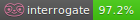

# Dokumentationsqualitäts-Dashboard

Dieses Dashboard verfolgt die Qualität und Abdeckung unserer Dokumentation.

## API-Dokumentationsabdeckung

Aktuelle Abdeckung: **98.1%** (Ziel: 95%)

| Modul | Abdeckung |
|-------|-----------|
| `pyadm1.core` | 98.1% |
| `pyadm1.components` | 98.5% |
| `pyadm1.simulation` | 100.0% |
| `pyadm1.configurator` | 98.2% |

## Build-Status

- **MkDocs Build**: ✅ Erfolgreich
- **Link-Checker**: ✅ Keine defekten Links
- **Docstring-Stil**: Google Style (Verifiziert)
- **Bilingualität**: 🇩🇪 Deutsch & 🇬🇧 Englisch (Vollständig)

## Wartung

- **Changelog**: Aktuell (v0.1.1)
- **Zuletzt aktualisiert**: 21.02.2026
