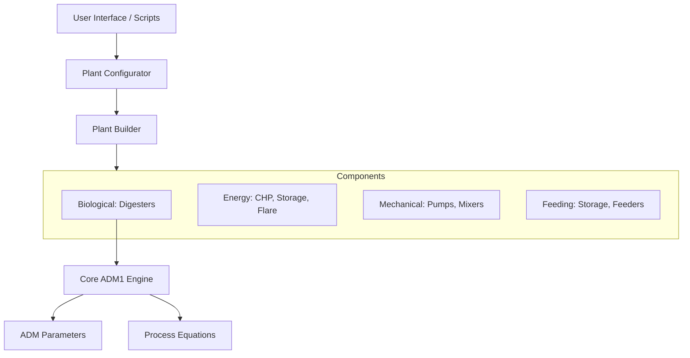
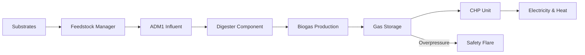
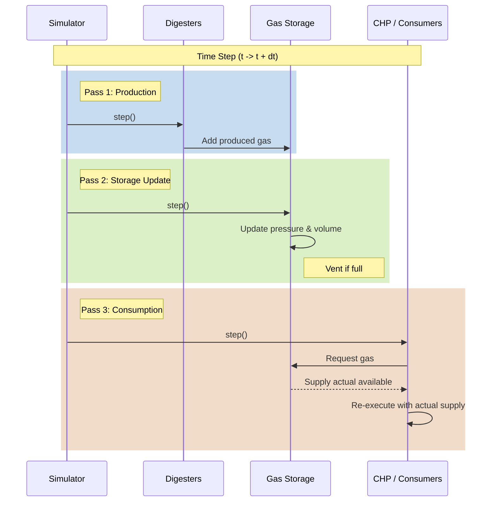

# Architecture

This page describes the system architecture and data flow of PyADM1ODE.

## System Overview

The framework is composed of several modular layers:

## Data Flow

## Three-Pass Simulation Process

To handle gas flow dependencies correctly, the simulation uses a three-pass model for each time step:

