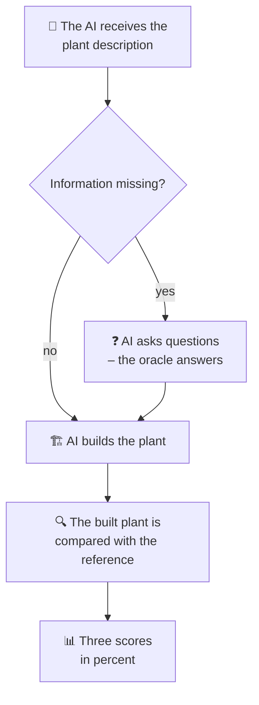

# Scoring & Workflow

This page explains **how a test runs** and **how the score is produced** – without
any programming knowledge.

## The workflow of a test

Step by step:

1. **Read the task:** The AI receives the description (text or sketch).
2. **Ask questions (only for incomplete tasks):** If something is missing, the AI may
   query the [oracle](datenpunkt.md).
3. **Build the plant:** The AI creates instructions with which PyADM1ODE actually
   assembles the plant.
4. **Compare:** The resulting plant is compared with the **reference** (the correct
   plant).
5. **Score:** From this, three scores in percent are produced.

!!! note "What does 'the AI builds the plant' mean?"
    The AI writes a short set of instructions in the language that PyADM1ODE
    understands. You can think of it as a **blueprint**: "Take a fermenter of this
    size, connect it to the secondary digester …". These instructions are executed,
    and a real, simulatable plant is created.

## The three scores

The result is examined from three angles. Each score is a percentage between 0 % and
100 %.

-   :material-graph-outline:{ .lg .middle } **1. Structure**

    ---

    Are the **right components** present and **correctly connected**? For example:
    does the digestate flow from the fermenter into the secondary digester and the
    biogas to the combined heat and power unit?

-   :material-ruler:{ .lg .middle } **2. Measures**

    ---

    Are the **sizes and values** correct – such as volume, temperature or the power
    of the combined heat and power unit? Checking uses a **tolerance range**, so
    small deviations are allowed.

-   :material-help-circle-outline:{ .lg .middle } **3. Gaps**

    ---

    Did the AI handle **missing information** correctly? Did it **ask** or **fill in
    plausibly** – instead of simply inventing a wrong value?

!!! info "Why a tolerance range?"
    In practice there is rarely a single "correct" value. A fermenter of 312 m³
    instead of 315 m³ is not an error. Therefore a value counts as correct if it lies
    **within a reasonable range** – not only on an exact match.

## What counts – and what does not

To keep the scoring fair and meaningful, some things are deliberately **not** scored:

- **Names do not matter:** The AI may name components differently. Comparison is by
  **type** of component (fermenter, pump …), not by name.
- **Substrates are not scored:** Which materials are fed in does not factor into the
  score – it is solely about the **structure** of the plant.
- **Most serious error:** Silently **inventing** an implausible value instead of
  asking is penalised most heavily.

## Note on sketch tasks

Tasks with a **sketch** (image) can only be solved by AI models that **understand
images**. A pure text model cannot "see" a sketch and would inevitably score 0 % on
such tasks – this is then **not** a content error of the model, but a question of
choosing the right model.

An overview of all technical terms can be found in the [glossary](glossar.md).
