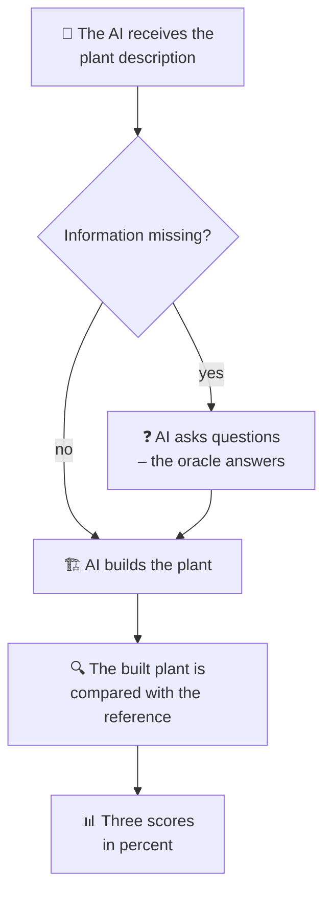

# Scoring & Workflow

This page explains **how a test runs** and **how the score is produced** – without
any programming knowledge.

## The workflow of a test

```mermaid
flowchart TB
    A["📝 The AI receives the<br>plant description"] --> B{Information missing?}
    B -- "yes" --> C["❓ AI asks questions<br>– the oracle answers"]
    B -- "no" --> D["🏗️ AI builds the plant"]
    C --> D
    D --> E["🔍 The built plant is<br>compared with the reference"]
    E --> F["📊 Three scores<br>in percent"]
```

Step by step:

1. **Read the task:** The AI receives the description (text, sketch or PDF).  
2. **Ask questions (only for incomplete tasks):** If something is missing, the AI may  
   query the [oracle](datenpunkt.md).  
3. **Build the plant:** The AI creates instructions with which PyADM1ODE actually  
   assembles the plant.  
4. **Compare:** The resulting plant is compared with the **reference** (the correct  
   plant).  
5. **Score:** From this, three scores in percent are produced.  

!!! note "What does 'the AI builds the plant' mean?"
    The AI writes a short set of instructions in the language that PyADM1ODE
    understands. You can think of it as a **blueprint**: "Take a fermenter of this
    size, connect it to the secondary digester …". These instructions are executed,
    and a real, simulatable plant is created.

## The three scores

The result is examined from three angles. Each score is a percentage between 0 % and
100 %. The three angles are deliberately chosen so that **every possible mistake maps
to exactly one** of them.

-   :material-playlist-check:{ .lg .middle } **1. Completeness**  

    ---

    Is **everything needed** there? If a vessel, a combined heat and power unit or a
    pipe between two components is missing, this score drops.

-   :material-ruler:{ .lg .middle } **2. Measures**  

    ---

    Are the **sizes and values** correct – such as volume, temperature or the power
    of the combined heat and power unit? Checking uses a **tolerance range**, so
    small deviations are allowed.

-   :material-alert-octagon-outline:{ .lg .middle } **3. No inventions**  

    ---

    Is **only** what belongs there actually there? If the AI adds an extra component
    or a pipe that does not exist, this score drops.

!!! info "How tight is the tolerance range?"
    Every figure the simulation needs is **either stated in the description or the AI
    can ask for it**. It never has to guess. The range is tight accordingly — it only
    covers what is unavoidable when calculating:

    - **If the value is taken over** (from the description or from the oracle), the AI  
      has to hit it. Only rounding is allowed: `40 °C` as `313.0` instead of `313.15 K`
      is fine, `39 °C` is not.  
    - **If the value has to be calculated** — a volume from diameter and height, say —  
      slightly more deviation is allowed. Depending on where you round, results differ.

## Every mistake counts exactly once

| What the AI gets wrong | Which score drops |
| --- | --- |
| **omits** a component or a pipe | 1. Completeness |
| **invents a value** that is not plausible | 2. Measures |
| **invents a component** or a pipe | 3. No inventions |

If the AI invents a component of a kind the plant does not have **at all** – a
separator in a plant without any separator, say – the third score is capped hard.
That is the most serious error.

Omitting does not pay off either: leaving out a component does not get rid of its
pipes – they then count as missing as well.

## What counts – and what does not

To keep the scoring fair and meaningful, some things are deliberately **not** scored:

- **Names do not matter:** The AI may name components differently. Comparison is by  
  **type** of component (fermenter, pump …), not by name.  
- **Substrates are not scored:** Which materials are fed in does not factor into the  
  score – it is solely about the **structure** of the plant.  
- **Asking questions is not graded:** Whether the AI asks is up to it. Only the plant  
  it finally produces is scored — guessing wrong costs points on **Measures**.

## Note on sketch and PDF tasks

Tasks with a **sketch** (image) can only be solved by AI models that **understand
images**. A pure text model cannot "see" a sketch and would inevitably score 0 % on
such tasks – this is then **not** a content error of the model, but a question of
choosing the right model.

**PDF tasks** do not need that: the text is extracted from the document and passed
on as text, so a pure text model can solve them too. The difficulty lies elsewhere –
the technical data sits between item numbers, prices and payment terms and has to be
picked out first.
