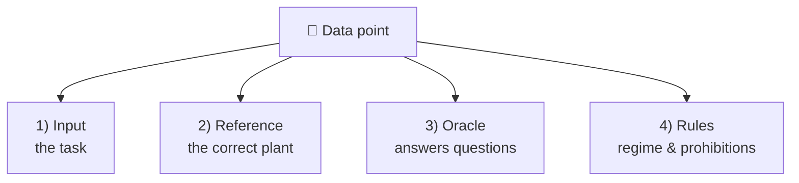

# A Data Point in Detail

A **data point** is **a single task** for the AI. It contains everything needed for
that task: the description of the plant, the correct solution for comparison, and a
few additional details for fair scoring.

This page explains the components in plain language.

## The four main components



### 1. The input – the actual task

This is the **description of the plant** that the AI gets to see. Depending on the
variant, it is a detailed text, a terse text or a sketch (image). The AI receives
**only** this input – nothing else.

### 2. The reference – the correct plant

The reference describes **what the plant should correctly look like**. It is the
"ground truth" against which the AI's result is measured. It consists of two lists:

- **Components:** all vessels and devices (e.g. fermenter, secondary digester,  
  digestate store, combined heat and power unit) with their key data such as size
  and temperature.  
- **Connections:** who is connected to whom – that is, where the digestate flows and  
  where the biogas is routed.

!!! example "A plant as components + connections (BGA2)"
    ```mermaid
    flowchart LR
        F1["Fermenter F1"] -->|digestate| N1["Secondary digester N1"]
        N1 -->|digestate| G1["Digestate store G1"]
        F1 -.biogas.-> BHKW["Combined heat &amp; power"]
        N1 -.biogas.-> BHKW
        G1 -.biogas.-> BHKW
    ```

### 3. The oracle – the expert for follow-up questions

Some descriptions are deliberately **incomplete** – just like in practice, where not
all information is always available. So that the AI can still proceed, there is the
**oracle**: a kind of expert that the AI may **ask specific questions** when
something is unclear.

If the AI asks, for example, "At what temperature does the fermenter run?", the
oracle provides the correct answer (e.g. "40 °C"). The oracle also recognises
**different phrasings** of the same question.

!!! tip "Why is there an oracle?"
    It is meant to distinguish two behaviours: a good AI **asks** when information is
    missing. A weaker AI simply **guesses** – and may get it wrong.

### 4. The rules – regime and prohibitions

Two additional pieces of information ensure fair scoring:

- **Regime** – describes whether the task is **complete** or **incomplete**:  

    - *fully specified*: All information is in the description. No asking needed.  
    - *underspecified*: Information is missing and must be asked for or sensibly  
      filled in.

- **Prohibitions** (`must_not_invent`) – things the AI **must not invent**. If a  
  plant has no combined heat and power unit, for instance, the AI must not add one.

## How "certain" a piece of information is

Not every detail is equally unambiguous. Therefore, each property records **where**
it comes from:

| Classification     | Meaning                                                          |
| ------------------ | ---------------------------------------------------------------- |
| **given**          | Stated directly in the description.                              |
| **derivable**      | Can be computed from other information (e.g. a volume from height and diameter). |
| **may be asked**   | Missing – the AI should ask or fill it in sensibly.              |
| **automatic**      | Created on its own during assembly (e.g. a gas storage for each fermenter). |

This allows fair scoring later on: the AI may fill in a missing value without it
counting as an error straight away – as long as the addition is plausible.

## A worked example: the gas storage volume

A vivid example is the **gas space** of a vessel. It is made up of two parts:

1. the **dome roof**, which sits on top of the vessel and serves as gas storage, and  
2. the **unfilled headspace** – the part of the vessel deliberately left without  
   liquid (typically around 10 %).

In the complete descriptions, the total gas space is stated directly, so the AI does
not have to derive it itself.

How a **score** is finally produced from all this information is explained on the
next page: [Scoring & Workflow](bewertung.md).
