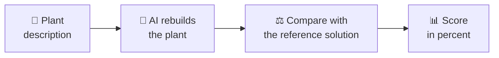

# Benchmark Dataset

The benchmark dataset is a collection of **described biogas plants**. It is used to
test how well an **artificial intelligence (AI)** can rebuild a working PyADM1ODE
model from the description of a plant.

!!! tip "In a nutshell"
    An AI reads the description of a biogas plant – as text or as a sketch – and is
    supposed to rebuild that same plant in the computer. The benchmark measures
    **how accurately** it succeeds.

## What is this about?

PyADM1ODE is software that can simulate biogas plants. To make the software compute
a **specific** plant, you first have to describe that plant: How many vessels are
there? How big are they? How are they connected? Is there a combined heat and power
unit?

Exactly this step – from a **description in words** to a **finished plant in the
software** – is the task the benchmark evaluates. The AI receives a description and
produces the plant from it. Its result is then compared against a known
**reference solution**.

## Why is this useful?

- **Comparability:** Different AI models solve the same tasks – you can objectively  
  see which one performs better.  
- **Realism:** The plants are based on real agricultural biogas plants.  
- **Understanding:** The dataset vividly shows what a biogas plant consists of and  
  what matters when modelling one.

## Who is this documentation for?

This introduction is aimed at readers **without programming experience**. No coding
knowledge is required – technical terms are explained, and a [glossary](glossar.md)
summarises the most important ones at the end.

## Where to go next

-   :material-folder-multiple:{ .lg .middle } **Dataset Structure**  

    ---

    Which plants exist, and how are the tasks organised?

    [:octicons-arrow-right-24: Dataset Structure](aufbau.md)

-   :material-file-document-outline:{ .lg .middle } **A Data Point in Detail**  

    ---

    What exactly is contained in a single task?

    [:octicons-arrow-right-24: A Data Point in Detail](datenpunkt.md)

-   :material-scale-balance:{ .lg .middle } **Scoring & Workflow**  

    ---

    How does a test run, and how is the score produced?

    [:octicons-arrow-right-24: Scoring & Workflow](bewertung.md)

-   :material-book-alphabet:{ .lg .middle } **Glossary**  

    ---

    All key terms briefly explained.

    [:octicons-arrow-right-24: Glossary](glossar.md)

