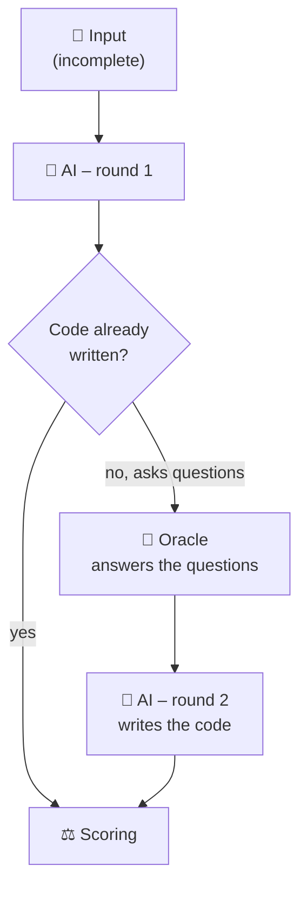

# How does the Oracle work?

Some plant descriptions are deliberately **incomplete** – just like in practice, where
not all information is always available. So that the AI can still proceed, there is the
**oracle**: a simulated expert that the AI may **ask specific questions** when
something is unclear. This page explains **when** the oracle is active, **how** a
question turns into an answer and **why** that matters for fair scoring.

For a first introduction see [A Data Point in Detail](datenpunkt.md); this page is
about the mechanism behind it.

## When is the oracle active?

The oracle is consulted **only** for under-specified tasks:

- **fully specified** (`fully_specified`): all information is in the description. There  
  is nothing to ask – the oracle stays silent.  
- **under-specified** (`underspecified`): values are missing. Only here may the AI ask  
  follow-up questions, and only then does the oracle answer.

!!! info "Basis: the `oracle` field"
    Every data point carries an `oracle` field – a dictionary of **field name →
    value**. It is the expert's only source of knowledge. Example (shortened):

    ```json
    "oracle": {
      "F1.T_ad": 313.15,
      "G1.T_ad": 293.15,
      "F1.fill_fraction": 0.9,
      "bgaa.exists": true,
      "chp.exists": false,
      "sep.source": "N1",
      "substrate_feed": "approx. 80 t/d maize silage and 20 m³/d cattle slurry"
    }
    ```

## The two-round workflow



1. **Round 1:** the AI receives the description. For under-specified tasks it may emit  
   its open questions as a small JSON block instead of guessing immediately:

    ```json
    { "open_questions": [{ "field": "F1.T_ad" }, { "field": "sep.source" }] }
    ```

2. **Oracle:** if the AI asks questions (and does not yet supply code), the oracle looks  
   up the matching values in the `oracle` field and returns them as an answer.  
3. **Round 2:** with the answers in hand, the AI writes the full PyADM1ODE code, which  
   is then scored.

If the AI already writes finished code in round 1, the oracle round is skipped. There
is **at most one** oracle round per data point (`oracle_turns` in the result).

## How a question becomes an answer

The oracle understands **different phrasings** of the same question. You do not have to
hit the internal field `F1.T_ad` – "At what temperature does the fermenter run?" is
enough. Matching runs in several stages, from the most precise to the most generous:

| Stage | What happens | Example |
| ----- | ------------ | ------- |
| **1. Exact match** | The question names the field directly. | `F1.T_ad` → `313.15` |
| **2. Keywords** | Synonyms are mapped to a quantity. | "temperature", "heated", "mesophilic" → all `*.T_ad` |
| **3. Component IDs** | A named component returns all of its fields. | "F1" → `F1.T_ad`, `F1.V_gas`, `F1.fill_fraction` |
| **4. Literal fields** | Field names appearing in the text are added. | "… `bgaa.capacity_m3h` …" |

The keyword table is **bilingual** (German and English) and covers typical terms – for
example "gas storage"/"Gasspeicher" for `V_gas`, "fill level"/"Füllgrad" for
`fill_fraction`, "rated power"/"Nennleistung" for `P_el_nom` or
"feedstock"/"Substrat" for `substrate_feed`. Terms such as "efficiency" deliberately
return **both** related fields (`eta_el` and `eta_th`).

!!! example "Question → oracle answer"
    The AI asks:

    ```json
    { "open_questions": [{ "field": "operating temperature of the fermenters" }] }
    ```

    The oracle replies:

    ```text
    Antworten auf deine Fragen:

    - F1.T_ad: 313.15
    - F2.T_ad: 313.15
    - N1.T_ad: 313.15
    - G1.T_ad: 293.15

    Bitte schreibe nun den vollständigen Python-Code.
    ```

### Helpful, but not omniscient

The oracle is deliberately **cooperative**:

- **No matching question recognised?** Then it would rather hand out **all** available  
  information than leave the AI stuck.  
- **Only a little asked?** If the AI asked for only a small part and at most five other  
  fields remain open, the oracle adds them as "further relevant information". A run thus
  does not fail because of a single forgotten question.

## Why the oracle exists

The oracle separates two behaviours that would otherwise be indistinguishable:

- A **good AI asks** when information is missing – and then builds the plant correctly.  
- A **weaker AI guesses** and may invent an implausible value.  

This is exactly what the scoring reflects: for under-specified data points the **gap
score** counts whether a missing field was **asked about** or plausibly **filled**
within the acceptance band. **Silently inventing** an implausible value is the most
serious mistake. See [Scoring & Workflow](bewertung.md) for the details.

!!! tip "`response.json` – recording questions and assumptions"
    If you evaluate your own model **offline**, make asked and assumed fields explicit
    in a `response.json` next to the code:

    ```json
    {
      "open_questions": [{ "field": "sep.source" }],
      "assumptions":    [{ "field": "F1.T_ad", "value": 313.15 }]
    }
    ```

    More about this under [Using the Dataset](nutzung.md).

## Turning the oracle off

For comparison the oracle can be disabled. The AI then asks **no** follow-up questions
and must plausibly assume missing values itself or work with defaults:

```bash
python benchmark/eval/solve.py --no-oracle
```

This shows how well a model copes with gaps **without** assistance – a useful
counter-check to the regular run with the oracle.

---

You can explore the dataset visually – including the expected follow-up questions and
the oracle answers per data point – in the [Viewer](viewer.md).
