# Basic Digester Example

The [examples/basic_digester.py](../../examples/01_basic_digester.py) example demonstrates the simplest possible PyADM1 configuration: a single digester with substrate feed and integrated gas storage.

## System Architecture

```mermaid
graph LR
    %% Substrate input
    Feed[Substrate Feed<br/>Corn silage: 15 m³/d<br/>Cattle manure: 10 m³/d] --> Digester

    %% Main digester
    Digester[Digester<br/>V_liq: 2000 m³<br/>V_gas: 300 m³<br/>T: 35°C]

    %% Integrated gas storage
    Digester -->|Biogas production| Storage[Gas Storage<br/>Membrane type<br/>Capacity: 300 m³<br/>P: 0.95-1.05 bar]

    %% Gas output
    Storage -->|Available biogas| Output[Biogas Output<br/>~1250 m³/d<br/>CH₄: ~60%]

    %% Excess venting
    Storage -.->|Excess gas<br/>when full| Vent[Vented to atmosphere<br/>or flare]

    %% Liquid output
    Digester -->|Effluent<br/>25 m³/d| Effluent[Digestate Output]

    %% Styling
    classDef processBox fill:#e1f5fe,stroke:#01579b,stroke-width:2px
    classDef storageBox fill:#fff3e0,stroke:#e65100,stroke-width:2px
    classDef inputBox fill:#f1f8e9,stroke:#33691e,stroke-width:2px
    classDef outputBox fill:#fce4ec,stroke:#880e4f,stroke-width:2px

    class Digester processBox
    class Storage storageBox
    class Feed inputBox
    class Output,Effluent,Vent outputBox
```



## Overview

The basic digester example shows:
- Loading substrate data (feedstock management)
- Creating a single-stage biogas plant
- Automatic gas storage creation per digester
- Initializing from a steady-state CSV file
- Running a short simulation (5 days)
- Extracting and displaying key process indicators

## Plant Configuration

The plant consists of:
- **1 Digester** (2000 m³ liquid volume, 300 m³ gas volume)
- **1 Gas Storage** (automatically created, attached to digester)
- **Substrate Feed**: Corn silage (15 m³/d) + Cattle manure (10 m³/d)

**Key Point**: The gas storage is automatically created by `PlantConfigurator.add_digester()` and connected to the digester. This ensures realistic gas buffering and pressure management.

## Code Walkthrough

### 1. Setup and Imports

```python
from pyadm1.configurator.plant_builder import BiogasPlant
from pyadm1.substrates.feedstock import Feedstock
from pyadm1.core.adm1 import get_state_zero_from_initial_state
from pyadm1.configurator.plant_configurator import PlantConfigurator
```

The key imports are:
- `BiogasPlant`: Container for all plant components
- `Feedstock`: Manages substrate properties and mixing
- `PlantConfigurator`: High-level helper for adding components (automatically handles gas storage)
- `get_state_zero_from_initial_state`: Loads initial state from CSV

### 2. Create Feedstock

```python
feeding_freq = 48  # Can change substrate every 48 hours
feedstock = Feedstock(feeding_freq=feeding_freq)
```

The feedstock object loads substrate parameters from [`substrate_gummersbach.xml`](../../data/substrates/substrate_gummersbach.xml) and manages:
- Substrate composition (Weender analysis)
- ADM1 parameter calculation
- Influent stream generation

**Feeding Frequency**: The `feeding_freq` parameter (48 hours) defines how often the controller can adjust substrate feeds. This is important for optimization and control applications.

### 3. Load Initial State

```python
initial_state_file = data_path / "digester_initial8.csv"
adm1_state = get_state_zero_from_initial_state(str(initial_state_file))
```

The initial state CSV contains 37 ADM1 state variables representing a steady-state condition. This avoids long initialization periods where the model transitions from unrealistic starting values.

**ADM1 State Vector** (37 variables):
- Soluble components (0-11): S_su, S_aa, S_fa, S_va, S_bu, S_pro, S_ac, S_h2, S_ch4, S_co2, S_nh4, S_I
- Particulate components (12-24): X_xc, X_ch, X_pr, X_li, X_su, X_aa, X_fa, X_c4, X_pro, X_ac, X_h2, X_I, X_p
- Ions (25-32): S_cation, S_anion, S_va_ion, S_bu_ion, S_pro_ion, S_ac_ion, S_hco3_ion, S_nh3
- Gas phase (33-36): pi_Sh2, pi_Sch4, pi_Sco2, pTOTAL

### 4. Define Substrate Feed

```python
Q_substrates = [15, 10, 0, 0, 0, 0, 0, 0, 0, 0]  # Corn silage and manure
```

The feed vector `Q_substrates` specifies volumetric flow rates [m³/d] for each substrate defined in the XML file. In this example:
- Substrate 1 (corn silage): 15 m³/d
- Substrate 2 (cattle manure): 10 m³/d
- Substrates 3-10: Not used (0 m³/d)

**Hydraulic retention time (HRT)**: 25 m³/d ÷ 2000 m³ = **0.0125 d⁻¹** or **HRT ≈ 80 days**

### 5. Build Plant with PlantConfigurator

```python
plant = BiogasPlant("Quickstart Plant")
configurator = PlantConfigurator(plant, feedstock)

configurator.add_digester(
    digester_id="main_digester",
    V_liq=2000.0,
    V_gas=300.0,
    T_ad=308.15,  # 35°C mesophilic
    name="Main Digester",
    load_initial_state=True,
    initial_state_file=str(initial_state_file),
    Q_substrates=Q_substrates,
)
```

**PlantConfigurator** provides a high-level API that:
- **Automatically creates and attaches a gas storage to each digester**
- Handles initialization with proper error checking
- Validates component parameters
- Manages connections between components

The gas storage is created with:
- **Type**: Membrane storage (low-pressure, typical for biogas)
- **Capacity**: Based on V_gas parameter (300 m³)
- **Pressure range**: 0.95-1.05 bar (typical membrane storage)
- **Initial fill**: 10% of capacity

**Design Parameters**:
- `V_liq=2000.0`: Liquid volume [m³] - typical for medium-scale farm plant
- `V_gas=300.0`: Gas headspace [m³] - about 15% of liquid volume
- `T_ad=308.15`: Operating temperature [K] = 35°C (mesophilic range)

### 6. Initialize and Simulate

```python
plant.initialize()

results = plant.simulate(
    duration=5.0,        # 5 days
    dt=1.0 / 24.0,      # 1 hour time step
    save_interval=1.0    # Save results daily
)
```

**Simulation Parameters**:
- `duration`: Total simulation time [days]
- `dt`: Integration time step [days]. 1 hour (1/24 day) is standard for ADM1
- `save_interval`: How often to save results [days]. Daily saves reduce memory usage

**Note**: The simulator uses a BDF (Backward Differentiation Formula) solver optimized for stiff ODEs like ADM1.

**Three-Pass Gas Flow Simulation**:
1. **Pass 1**: Digester produces biogas → Gas storage receives
2. **Pass 2**: Gas storage updates internal state (pressure, volume)
3. **Pass 3**: Gas available for downstream consumers (CHPs, etc.)

### 7. Display Results

```python
for result in results:
    comp_results = result["components"]["main_digester"]
    print(f"Day {time:.1f}:")
    print(f"  Biogas:  {comp_results.get('Q_gas', 0):>8.1f} m³/d")
    print(f"  Methane: {comp_results.get('Q_ch4', 0):>8.1f} m³/d")
    print(f"  pH:      {comp_results.get('pH', 0):>8.2f}")
    print(f"  VFA:     {comp_results.get('VFA', 0):>8.2f} g/L")
    print(f"  TAC:     {comp_results.get('TAC', 0):>8.2f} g/L")
```

**Key Process Indicators**:
- **Q_gas**: Total biogas production [m³/d]
- **Q_ch4**: Methane production [m³/d]
- **pH**: Process pH (optimal: 6.8-7.5)
- **VFA**: Volatile Fatty Acids [g HAc-eq/L] (optimal: <3 g/L)
- **TAC**: Total Alkalinity [g CaCO₃-eq/L] (optimal: >6 g/L)

**Gas Storage Indicators** (included in digester results):
- **stored_volume_m3**: Current gas volume in storage [m³]
- **pressure_bar**: Current storage pressure [bar]
- **vented_volume_m3**: Gas vented this timestep [m³]
- **Q_gas_supplied_m3_per_day**: Gas available for consumers [m³/d]

## Expected Output

Running this example produces output like:

```
======================================================================
PyADM1 Quickstart Example (PlantConfigurator version)
======================================================================

1. Creating feedstock...
2. Loading initial state from CSV...
   Loading from: digester_initial8.csv
3. Creating biogas plant...
4. Adding digester with PlantConfigurator...
   - Digester 'main_digester' created
   - Gas storage 'main_digester_storage' automatically created
   - Initial state: Loaded from digester_initial8.csv
5. Initializing plant...
6. Running simulation...
   Duration: 5 days
   Time step: 1 hour
   Save interval: 1 day

======================================================================
SIMULATION RESULTS
======================================================================

Generated 6 daily result snapshots

Day 0.0:
  Biogas:   1245.3 m³/d
  Methane:   748.2 m³/d
  pH:          7.28
  VFA:         2.34 g/L
  TAC:         8.45 g/L
  Storage:
    - Volume: 30.0 m³ (10% full)
    - Pressure: 0.97 bar
    - Vented: 0.0 m³

Day 1.0:
  Biogas:   1248.7 m³/d
  Methane:   750.1 m³/d
  pH:          7.29
  VFA:         2.32 g/L
  TAC:         8.47 g/L
  Storage:
    - Volume: 82.3 m³ (27% full)
    - Pressure: 1.01 bar
    - Vented: 0.0 m³

...

======================================================================
FINAL SUMMARY
======================================================================
Total biogas production:  1251.4 m³/d
Total methane production: 751.9 m³/d
Methane content:          60.1%
Process stability (pH):   7.30
Gas storage utilization:  35%
======================================================================

✅ Simulation completed successfully!

💾 Configuration saved to: output/quickstart_config.json
```

## Process Interpretation

### Typical Performance Metrics

For this configuration (25 m³/d feed, HRT ≈ 80 days):

| Metric | Value | Assessment |
|--------|-------|------------|
| Biogas production | ~1250 m³/d | Good |
| Methane content | ~60% | Typical for agricultural substrates |
| Specific gas yield | ~50 m³/m³ feed | Good for corn silage + manure mix |
| pH | 7.28-7.30 | Optimal (stable) |
| VFA | 2.3-2.4 g/L | Good (well below 3 g/L limit) |
| TAC | 8.4-8.5 g CaCO₃/L | Excellent buffer capacity |
| FOS/TAC | ~0.27 | Stable process (< 0.3) |

### Process Stability Indicators

**pH Stability**: The pH remains around 7.3, indicating:
- Good buffer capacity (high TAC)
- Balanced VFA production and consumption
- No acidification risk

**VFA/TAC Balance**: VFA at 2.3 g/L with TAC at 8.4 g/L gives FOS/TAC ≈ 0.27:
- < 0.3: Stable process
- 0.3-0.4: Monitor closely
- > 0.4: Risk of acidification

**Methane Content**: 60% CH₄ is typical for:
- Energy crops (corn silage)
- Animal manure
- Mesophilic digestion

## Gas Storage Behavior

The automatically created gas storage:
- **Type**: Low-pressure membrane storage
- **Capacity**: ~300 m³ (based on V_gas)
- **Pressure range**: 0.95-1.05 bar
- **Function**: Buffers gas production fluctuations
- **Safety**: Vents excess gas when full to prevent overpressure

**Storage Dynamics**:
```python
'gas_storage': {
    'stored_volume_m3': 150.0,      # Current gas volume
    'pressure_bar': 1.01,            # Current pressure
    'vented_volume_m3': 0.0,         # Vented this timestep
    'utilization': 0.50,             # 50% full
    'Q_gas_supplied_m3_per_day': 1250.0  # Available for consumers
}
```

**When storage fills up**:
- Pressure increases from 0.95 to 1.05 bar
- At 1.05 bar (full capacity), excess gas is vented
- Venting prevents overpressure and equipment damage
- In real plants, vented gas goes to flare for safety combustion

## Configuration Export

The plant configuration is saved to JSON:

```json
{
  "plant_name": "Quickstart Plant",
  "simulation_time": 5.0,
  "components": [
    {
      "component_id": "main_digester",
      "component_type": "digester",
      "V_liq": 2000.0,
      "V_gas": 300.0,
      "T_ad": 308.15,
      "state": {...}
    },
    {
      "component_id": "main_digester_storage",
      "component_type": "storage",
      "storage_type": "membrane",
      "capacity_m3": 300.0,
      "p_min_bar": 0.95,
      "p_max_bar": 1.05
    }
  ],
  "connections": [
    {
      "from": "main_digester",
      "to": "main_digester_storage",
      "type": "gas"
    }
  ]
}
```

This JSON file can be reloaded to restore the exact plant state:

```python
plant = BiogasPlant.from_json("output/quickstart_config.json", feedstock)
```

## Next Steps

After running this basic example:

1. **Try parameter variations**:
   - Adjust substrate feed rates in `Q_substrates`
   - Change digester temperature `T_ad`
   - Modify digester volume `V_liq`

2. **Extend simulation duration**:
   ```python
   results = plant.simulate(duration=30.0, dt=1.0/24.0)
   ```

3. **Add energy components**:
   See [`two_stage_plant.md`](two_stage_plant.md) for CHP and heating integration

4. **Implement control**:
   Use `Simulator.determine_best_feed_by_n_sims()` for optimization

## Common Issues

### Issue: "Initial state file not found"

**Solution**: Ensure `data/initial_states/digester_initial8.csv` exists, or set `load_initial_state=False`:

```python
configurator.add_digester(
    digester_id="main_digester",
    V_liq=2000.0,
    load_initial_state=False,  # Use default initialization
    Q_substrates=Q_substrates,
)
```

### Issue: Low gas production

**Causes**:
- HRT too short (increase V_liq or reduce Q_substrates)
- Substrate feed too low (increase values in Q_substrates)
- Temperature too low (increase T_ad)

**Example fix**:
```python
Q_substrates = [20, 15, 0, 0, 0, 0, 0, 0, 0, 0]  # Increase feed
```

### Issue: Process instability (pH drop)

**Causes**:
- Organic overload (reduce Q_substrates)
- Insufficient buffer capacity

**Example fix**:
```python
# Add buffer substrate (e.g., lime at index 7)
Q_substrates = [15, 10, 0, 0, 0, 0, 0, 1, 0, 0]  # 1 m³/d lime
```

### Issue: Gas storage overpressure warnings

**Symptoms**:
- Frequent venting messages
- Storage constantly at maximum pressure

**Solutions**:
```python
# Increase gas storage capacity
configurator.add_digester(
    digester_id="main_digester",
    V_liq=2000.0,
    V_gas=500.0,  # Increased from 300
    Q_substrates=Q_substrates,
)
```

## References

- **ADM1 Model**: Batstone et al. (2002). *Anaerobic Digestion Model No. 1*. IWA Publishing.
- **PyADM1**: Sadrimajd et al. (2021). *PyADM1: a Python implementation of ADM1*. bioRxiv.
- **Substrate Characterization**: Gaida (2014). *Dynamic real-time substrate feed optimization of anaerobic co-digestion plants*. PhD thesis, Leiden University.
- **Leitfaden Biogas**: FNR (2016). https://mediathek.fnr.de/leitfaden-biogas.html

## Related Examples

- [`two_stage_plant.md`](two_stage_plant.md): Two-stage digestion with CHP and heating
- `calibration_workflow.md`: Parameter estimation from measurement data
- `substrate_optimization.py`: Optimal feed strategy
- [`parallel_two_stage_simulation.py`](../../examples/parallel_two_stage_simulation.py): Parallel simulations
