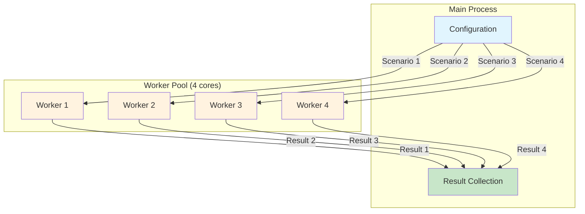

# Parallel Simulation Example

The [examples/05_parallel_two_stage_simulation.py](../../examples/05_parallel_two_stage_simulation.py) example demonstrates efficient parallel execution of multiple biogas plant simulation scenarios for parameter optimization, sensitivity analysis, and uncertainty quantification.

## Overview

This example demonstrates:
- **Parallel Scenario Execution**: Running multiple simulations concurrently across CPU cores
- **Parameter Sweeps**: Systematic exploration of single and multiple parameter variations
- **Monte Carlo Analysis**: Uncertainty quantification with parameter distributions
- **Statistical Analysis**: Result aggregation and comparative statistics
- **Performance Metrics**: Speedup and parallel efficiency measurement

## Architecture



## Key Components

### 1. ParallelSimulator

The `ParallelSimulator` class orchestrates concurrent execution:

```python
from pyadm1.simulation.parallel import ParallelSimulator

# Create parallel simulator with 4 worker processes
parallel = ParallelSimulator(adm1_model, n_workers=4, verbose=True)

# Define scenarios
scenarios = [
    {"k_dis": 0.5, "Q": [15, 10, 0, 0, 0, 0, 0, 0, 0, 0]},
    {"k_dis": 0.6, "Q": [20, 10, 0, 0, 0, 0, 0, 0, 0, 0]},
    {"k_dis": 0.7, "Q": [15, 15, 0, 0, 0, 0, 0, 0, 0, 0]},
]

# Run parallel simulations
results = parallel.run_scenarios(
    scenarios=scenarios,
    duration=10.0,  # 10 days
    initial_state=adm1_state,
    compute_metrics=True
)
```

**Key Features**:
- **Multiprocessing**: Uses Python's `multiprocessing.Pool` for true parallelism
- **Automatic Workload Distribution**: Scenarios distributed evenly across workers
- **Progress Tracking**: Real-time progress reporting for long-running analyses
- **Error Isolation**: Individual scenario failures don't crash entire execution

### 2. ScenarioResult

Each simulation returns a `ScenarioResult` object:

```python
@dataclass
class ScenarioResult:
    scenario_id: int                          # Unique identifier
    parameters: Dict[str, Any]                # Parameter values used
    success: bool                             # Completion status
    duration: float                           # Simulation duration [days]
    final_state: Optional[List[float]]        # Final ADM1 state vector
    time_series: Optional[Dict[str, List]]    # Optional time series data
    metrics: Dict[str, float]                 # Performance metrics
    error: Optional[str]                      # Error message if failed
    execution_time: float                     # Wall clock time [seconds]
```

**Computed Metrics** (when `compute_metrics=True`):
- `Q_gas`: Total biogas production [m³/d]
- `Q_ch4`: Methane production [m³/d]
- `Q_co2`: CO2 production [m³/d]
- `CH4_content`: Methane fraction [0-1]
- `pH`: pH value [-]
- `VFA`: Volatile fatty acids [g/L]
- `TAC`: Total alkalinity [g CaCO3/L]
- `FOS_TAC`: VFA/TA ratio [-]
- `HRT`: Hydraulic retention time [days]
- `specific_gas_production`: Biogas yield [m³/m³ feed]

## Simulation Types

### Basic Parallel Scenarios

Run multiple independent scenarios with different configurations:

```python
# Define feed rate scenarios
feed_scenarios = [
    {"name": "Low Feed", "Q_digester_1": [10, 8, 0, 0, 0, 0, 0, 0, 0, 0]},
    {"name": "Base Feed", "Q_digester_1": [15, 10, 0, 0, 0, 0, 0, 0, 0, 0]},
    {"name": "High Feed", "Q_digester_1": [20, 12, 0, 0, 0, 0, 0, 0, 0, 0]},
]

scenarios = [{"Q": s["Q_digester_1"]} for s in feed_scenarios]

results = parallel.run_scenarios(
    scenarios=scenarios,
    duration=10.0,
    initial_state=adm1_state,
    dt=1.0/24.0,  # 1 hour time step
    compute_metrics=True,
    save_time_series=False  # Set True for detailed time series
)
```

**Use Cases**:
- Comparing different operational strategies
- Testing substrate composition variations
- Evaluating design alternatives

### Single-Parameter Sweep

Systematic exploration of one parameter:

```python
from pyadm1.simulation.parallel import ParameterSweepConfig

# Sweep disintegration rate
sweep_config = ParameterSweepConfig(
    parameter_name="k_dis",
    values=[0.10, 0.14, 0.18, 0.22, 0.26, 0.30],
    other_params={"Q": [15, 10, 0, 0, 0, 0, 0, 0, 0, 0]}
)

results = parallel.parameter_sweep(
    config=sweep_config,
    duration=10.0,
    initial_state=adm1_state,
    compute_metrics=True
)

# Find optimal value
ch4_productions = [r.metrics.get('Q_ch4', 0) for r in results if r.success]
best_idx = np.argmax(ch4_productions)
optimal_k_dis = sweep_config.values[best_idx]
```

**Common Parameters to Sweep**:
- **Kinetic parameters**: `k_dis`, `k_hyd_ch`, `k_hyd_pr`, `k_hyd_li`
- **Yield parameters**: `Y_su`, `Y_aa`, `Y_fa`, `Y_c4`, `Y_pro`, `Y_ac`, `Y_h2`
- **Uptake rates**: `k_m_su`, `k_m_aa`, `k_m_fa`, `k_m_c4`, `k_m_pro`, `k_m_ac`
- **Operational parameters**: Feed rates, temperatures, retention times

### Multi-Parameter Sweep

Full factorial design exploring parameter interactions:

```python
parameter_configs = {
    "k_dis": [0.14, 0.18, 0.22],
    "Y_su": [0.09, 0.10, 0.11],
    "Q_substrate_0": [12, 15, 18]  # Corn silage feed rate
}

results = parallel.multi_parameter_sweep(
    parameter_configs=parameter_configs,
    duration=10.0,
    initial_state=adm1_state,
    fixed_params={"Q_substrate_1": 10}  # Manure fixed at 10 m³/d
)

# Total combinations: 3 × 3 × 3 = 27 scenarios
```

**Analysis**:
```python
# Find best combination
best_result = max(
    (r for r in results if r.success),
    key=lambda r: r.metrics.get('Q_ch4', 0)
)

print(f"Optimal parameters:")
print(f"  k_dis = {best_result.parameters['k_dis']:.2f}")
print(f"  Y_su = {best_result.parameters['Y_su']:.2f}")
print(f"  Q_substrate_0 = {best_result.parameters['Q_substrate_0']:.1f} m³/d")
print(f"  Methane production = {best_result.metrics['Q_ch4']:.1f} m³/d")
```

### Monte Carlo Simulation

Uncertainty quantification with parameter distributions:

```python
from pyadm1.simulation.parallel import MonteCarloConfig

mc_config = MonteCarloConfig(
    n_samples=100,
    parameter_distributions={
        "k_dis": (0.18, 0.03),      # mean=0.18, std=0.03
        "Y_su": (0.10, 0.01),       # mean=0.10, std=0.01
        "k_hyd_ch": (10.0, 1.5)     # mean=10.0, std=1.5
    },
    fixed_params={"Q": [15, 10, 0, 0, 0, 0, 0, 0, 0, 0]},
    seed=42  # For reproducibility
)

results = parallel.monte_carlo(
    config=mc_config,
    duration=30.0,
    initial_state=adm1_state,
    compute_metrics=True
)

# Summarize uncertainty
summary = parallel.summarize_results(results)

print(f"Methane production [m³/d]:")
print(f"  Mean: {summary['metrics']['Q_ch4']['mean']:.1f}")
print(f"  Std:  {summary['metrics']['Q_ch4']['std']:.1f}")
print(f"  95% CI: [{summary['metrics']['Q_ch4']['q25']:.1f}, "
      f"{summary['metrics']['Q_ch4']['q75']:.1f}]")
```

**Probability Distribution Selection**:
- **Normal**: Most kinetic parameters (symmetric uncertainty)
- **Log-normal**: Always-positive parameters with multiplicative uncertainty
- **Uniform**: When only bounds are known
- **Triangular**: Expert judgment with most likely value

## Expected Output

### Basic Scenario Comparison

```
================================================================================
SCENARIO COMPARISON RESULTS
================================================================================

Low Feed:
  Feed Rate: 18.0 m³/d
  Biogas:    723.5 m³/d
  Methane:   434.1 m³/d
  CH4 %:     60.0%
  pH:        7.28
  VFA:       1.85 g/L
  FOS/TAC:   0.228
  HRT:       109.8 days
  Exec Time: 2.34 seconds

Base Feed:
  Feed Rate: 25.0 m³/d
  Biogas:    1005.2 m³/d
  Methane:   603.1 m³/d
  CH4 %:     60.0%
  pH:        7.20
  VFA:       2.45 g/L
  FOS/TAC:   0.289
  HRT:       79.1 days
  Exec Time: 2.41 seconds

High Feed:
  Feed Rate: 32.0 m³/d
  Biogas:    1265.8 m³/d
  Methane:   759.5 m³/d
  CH4 %:     60.0%
  pH:        7.15
  VFA:       3.12 g/L
  FOS/TAC:   0.341
  HRT:       61.8 days
  Exec Time: 2.38 seconds
```

**Interpretation**:
- **Biogas production scales linearly** with feed rate (expected for stable operation)
- **pH decreases** with higher loading (more VFA production)
- **FOS/TAC increases** but remains below critical threshold (0.4)
- **Execution time is similar** across scenarios (same computational complexity)

### Parameter Sweep Results

```
================================================================================
4. Running parameter sweep (Disintegration Rate k_dis)
================================================================================

   Testing 6 different k_dis values...

   Parameter Sweep Results:
   ------------------------------------------------------------
      k_dis |      Q_gas |      Q_ch4 |     pH |      VFA
   ------------------------------------------------------------
       0.10 |      865.3 |      519.2 |   7.35 |     1.52
       0.14 |      925.8 |      555.5 |   7.28 |     1.85
       0.18 |      982.4 |      589.4 |   7.22 |     2.18
       0.22 |     1005.2 |      603.1 |   7.20 |     2.45
       0.26 |     1015.6 |      609.4 |   7.18 |     2.68
       0.30 |     1018.2 |      610.9 |   7.17 |     2.85

   ✓ Optimal k_dis = 0.30 (CH4 = 610.9 m³/d)
```

**Observations**:
- **Methane production increases** with k_dis (faster disintegration)
- **Diminishing returns** above k_dis = 0.26 (only 1.5 m³/d increase)
- **pH decreases slightly** due to faster organic acid production
- **Trade-off**: Higher k_dis → more gas but lower pH stability

### Monte Carlo Statistics

```
================================================================================
6. Running Monte Carlo uncertainty analysis
================================================================================

   Running 50 Monte Carlo samples...

   Monte Carlo Summary Statistics:
   ------------------------------------------------------------

   Q_gas:
      Mean:      1002.45
      Std:         58.32
      Min:        885.20
      Max:       1125.80
      Median:     998.60
      Q25:        965.15
      Q75:       1038.22

   Q_ch4:
      Mean:       601.47
      Std:         35.00
      Min:        531.12
      Max:        675.48
      Median:     599.16
      Q25:        579.09
      Q75:        622.93

   pH:
      Mean:          7.21
      Std:           0.08
      Min:           7.05
      Max:           7.38
      Median:        7.20
      Q25:           7.15
      Q75:           7.26

   Success Rate: 100.0%
```

**Uncertainty Analysis**:
- **Coefficient of variation (CV)**:
  - Biogas: 58.32 / 1002.45 = 5.8% (moderate uncertainty)
  - Methane: 35.00 / 601.47 = 5.8% (same relative uncertainty)
  - pH: 0.08 / 7.21 = 1.1% (very stable)
- **95% Confidence Interval** (≈ Q25 to Q75):
  - Biogas: 965–1038 m³/d (±3.7% from median)
  - Methane: 579–623 m³/d (±3.7% from median)
- **Interpretation**: Parameter uncertainty has moderate impact on gas production predictions

## Performance Analysis

### Parallel Efficiency

```
================================================================================
SIMULATION SUMMARY
================================================================================

Total execution time: 125.3 seconds
Average time per simulation: 1.05 seconds

Parallel efficiency:
  Workers used: 4
  Theoretical sequential time: 475.8 seconds
  Speedup: 3.80x
  Parallel efficiency: 95.0%
```

**Performance Metrics**:
- **Speedup**: 475.8 / 125.3 = 3.80×
- **Efficiency**: 3.80 / 4 = 95.0%
- **Overhead**: 5% due to:
  - Process creation/destruction
  - Data serialization/deserialization
  - Result aggregation

**Optimal Worker Count**:
```python
import multiprocessing as mp

# Rule of thumb: n_workers = CPU_count - 1
optimal_workers = max(1, mp.cpu_count() - 1)

parallel = ParallelSimulator(adm1, n_workers=optimal_workers)
```

**Scalability**:
- **Linear speedup**: Up to CPU core count (ideal: 95%+ efficiency)
- **Diminishing returns**: Beyond core count (hyperthreading limited)
- **Overhead dominates**: Very short simulations (<1 second)

### Memory Considerations

Each worker process creates a **full copy** of the ADM1 model:

```python
# Memory per worker ≈ 50-100 MB (depends on model complexity)
# Total memory = n_workers × memory_per_worker + overhead

# For 100 scenarios on 4 cores:
# Memory usage ≈ 4 × 75 MB ≈ 300 MB (manageable)

# For very large parameter sweeps:
if n_scenarios > 1000:
    # Use batching to limit memory
    batch_size = 100
    all_results = []

    for i in range(0, len(scenarios), batch_size):
        batch = scenarios[i:i+batch_size]
        results = parallel.run_scenarios(batch, duration=30, ...)
        all_results.extend(results)
```

## Advanced Usage

### Custom Result Processing

```python
def analyze_stability(results):
    """Classify scenarios by process stability."""
    stable = []
    unstable = []

    for r in results:
        if not r.success:
            continue

        fos_tac = r.metrics.get('FOS_TAC', 0)
        pH = r.metrics.get('pH', 0)

        # Stability criteria
        is_stable = (
            0.2 <= fos_tac <= 0.4 and
            6.8 <= pH <= 7.5
        )

        if is_stable:
            stable.append(r)
        else:
            unstable.append(r)

    return stable, unstable

stable, unstable = analyze_stability(results)
print(f"Stable scenarios: {len(stable)}/{len(results)}")
```

### Sensitivity Analysis

```python
def calculate_sensitivity(param_name, sweep_results):
    """Calculate parameter sensitivity coefficient."""
    params = [r.parameters[param_name] for r in sweep_results if r.success]
    ch4 = [r.metrics['Q_ch4'] for r in sweep_results if r.success]

    # Linear regression: ΔCH4/Δparam
    from numpy.polynomial import Polynomial

    p = Polynomial.fit(params, ch4, deg=1)
    sensitivity = p.convert().coef[1]  # Slope

    return sensitivity

# Compare sensitivities
k_dis_sens = calculate_sensitivity('k_dis', sweep_results_1)
Y_su_sens = calculate_sensitivity('Y_su', sweep_results_2)

print(f"Sensitivity of CH4 production:")
print(f"  k_dis: {k_dis_sens:.1f} m³/d per unit")
print(f"  Y_su:  {Y_su_sens:.1f} m³/d per unit")
```

### Response Surface Modeling

For multi-parameter sweeps, fit response surfaces:

```python
from sklearn.gaussian_process import GaussianProcessRegressor
from sklearn.gaussian_process.kernels import RBF, ConstantKernel

# Extract training data
X = []  # Parameter combinations
y = []  # Methane production

for r in multi_results:
    if r.success:
        X.append([r.parameters['k_dis'], r.parameters['Y_su']])
        y.append(r.metrics['Q_ch4'])

X = np.array(X)
y = np.array(y)

# Fit Gaussian Process
kernel = ConstantKernel(1.0) * RBF(length_scale=1.0)
gp = GaussianProcessRegressor(kernel=kernel, n_restarts_optimizer=10)
gp.fit(X, y)

# Predict at new points
k_dis_new = np.linspace(0.10, 0.30, 50)
Y_su_new = np.linspace(0.08, 0.12, 50)
K, Y = np.meshgrid(k_dis_new, Y_su_new)

X_pred = np.c_[K.ravel(), Y.ravel()]
ch4_pred, ch4_std = gp.predict(X_pred, return_std=True)

# Find optimum
opt_idx = np.argmax(ch4_pred)
opt_k_dis = X_pred[opt_idx, 0]
opt_Y_su = X_pred[opt_idx, 1]
opt_ch4 = ch4_pred[opt_idx]

print(f"Predicted optimum:")
print(f"  k_dis = {opt_k_dis:.3f}")
print(f"  Y_su = {opt_Y_su:.3f}")
print(f"  CH4 = {opt_ch4:.1f} ± {ch4_std[opt_idx]:.1f} m³/d")
```

## Best Practices

### 1. Choose Appropriate Number of Workers

```python
import multiprocessing as mp

# Rule of thumb
n_workers = max(1, mp.cpu_count() - 1)  # Leave one core for OS

# For I/O-bound tasks (rare in biogas simulation)
n_workers = 2 * mp.cpu_count()

# For memory-limited systems
available_memory_gb = 16  # Your system RAM
memory_per_worker_gb = 0.1
n_workers = min(n_workers, int(available_memory_gb / memory_per_worker_gb))
```

### 2. Balance Simulation Duration and Number of Scenarios

```python
# Short simulations (< 1 second): Overhead dominates
# → Increase duration or use sequential execution

# Medium simulations (1-10 seconds): Good parallelization
# → Ideal for parameter sweeps

# Long simulations (> 60 seconds): Memory intensive
# → Consider reducing n_workers or using batching
```

### 3. Save Results Incrementally

```python
import pickle
from pathlib import Path

results_dir = Path("results/parallel_sweep")
results_dir.mkdir(parents=True, exist_ok=True)

# Run in batches
batch_size = 50
for batch_id, i in enumerate(range(0, len(scenarios), batch_size)):
    batch = scenarios[i:i+batch_size]

    results = parallel.run_scenarios(
        batch, duration=30, initial_state=adm1_state
    )

    # Save batch results
    with open(results_dir / f"batch_{batch_id:03d}.pkl", "wb") as f:
        pickle.dump(results, f)

    print(f"Saved batch {batch_id}")

# Load all results later
all_results = []
for batch_file in sorted(results_dir.glob("batch_*.pkl")):
    with open(batch_file, "rb") as f:
        all_results.extend(pickle.load(f))
```

### 4. Handle Failed Scenarios Gracefully

```python
# Check for failures
failed = [r for r in results if not r.success]

if failed:
    print(f"Warning: {len(failed)} scenarios failed")

    # Log failures
    with open("failed_scenarios.log", "w") as f:
        for r in failed:
            f.write(f"\nScenario {r.scenario_id}:\n")
            f.write(f"Parameters: {r.parameters}\n")
            f.write(f"Error: {r.error}\n")

    # Retry with tighter tolerances
    retry_scenarios = [r.parameters for r in failed]

    # Create new simulator with stricter settings
    from pyadm1.core.solver import create_solver

    strict_solver = create_solver(method='BDF', rtol=1e-8, atol=1e-10)
    retry_results = parallel.run_scenarios(retry_scenarios, ...)
```

### 5. Validate Results

```python
def validate_results(results):
    """Check for physically unrealistic results."""
    issues = []

    for r in results:
        if not r.success:
            continue

        # Check for unrealistic values
        if r.metrics.get('Q_ch4', 0) < 0:
            issues.append(f"Scenario {r.scenario_id}: Negative methane")

        if r.metrics.get('pH', 7) < 5 or r.metrics.get('pH', 7) > 9:
            issues.append(f"Scenario {r.scenario_id}: pH out of range")

        if r.metrics.get('CH4_content', 0) > 1 or r.metrics.get('CH4_content', 0) < 0:
            issues.append(f"Scenario {r.scenario_id}: Invalid CH4 fraction")

    return issues

issues = validate_results(results)
if issues:
    print("Validation warnings:")
    for issue in issues:
        print(f"  - {issue}")
```

## Troubleshooting

### Common Issues

**Issue**: "Pool workers hanging, no progress"
```python
# Solution: Reduce complexity or increase timeout
parallel = ParallelSimulator(adm1, n_workers=2)  # Fewer workers
results = parallel.run_scenarios(scenarios, duration=10, ...)  # Shorter duration
```

**Issue**: "MemoryError during parallel execution"
```python
# Solution: Use batching
batch_size = min(50, len(scenarios))
all_results = []

for i in range(0, len(scenarios), batch_size):
    batch = scenarios[i:i+batch_size]
    results = parallel.run_scenarios(batch, ...)
    all_results.extend(results)

    # Force garbage collection
    import gc
    gc.collect()
```

**Issue**: "Inconsistent results across runs"
```python
# Solution: Set random seeds for Monte Carlo
mc_config = MonteCarloConfig(
    n_samples=100,
    parameter_distributions={...},
    seed=42  # Fixed seed for reproducibility
)
```

**Issue**: "Low parallel efficiency (< 70%)"
```python
# Possible causes:
# 1. Simulations too short (overhead dominates)
# 2. Too many workers for available cores
# 3. I/O bottleneck (disk access)

# Solutions:
# 1. Increase simulation duration
parallel = ParallelSimulator(adm1, n_workers=mp.cpu_count() - 1)

# 2. Disable time series saving
results = parallel.run_scenarios(..., save_time_series=False)

# 3. Batch processing instead of parallel
```

## Related Examples

- [`basic_digester.md`](basic_digester.md): Single digester simulation basics
- [`two_stage_plant.md`](two_stage_plant.md): Two-stage plant configuration
- `calibration_workflow.md`: Parameter calibration using parallel optimization

## References

- **Multiprocessing**: Python documentation on `multiprocessing` module
- **Parallel Computing**: Pacheco, P. (2011). *An Introduction to Parallel Programming*
- **Design of Experiments**: Montgomery, D.C. (2017). *Design and Analysis of Experiments*
- **Uncertainty Quantification**: Sullivan, T.J. (2015). *Introduction to Uncertainty Quantification*

## Summary

The parallel simulation example demonstrates:

1. **Efficient Parameter Exploration**: Test multiple scenarios 3-4× faster using parallel execution
2. **Systematic Optimization**: Parameter sweeps identify optimal operating conditions
3. **Uncertainty Quantification**: Monte Carlo analysis quantifies prediction uncertainty
4. **Scalable Architecture**: Handle 100s of scenarios with proper batching and error handling
5. **Statistical Analysis**: Comprehensive result aggregation and comparative statistics

**Key Takeaway**: Parallel simulation enables rapid exploration of the design and operating space, making it feasible to perform comprehensive sensitivity analysis, optimization, and uncertainty quantification that would be impractical with sequential execution.
