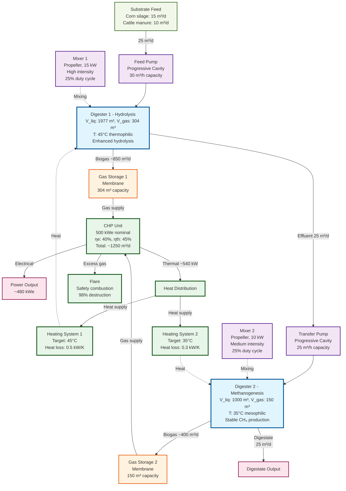

# Two-Stage Biogas Plant Example

The [examples/two_stage_plant.py](../../examples/02_two_stage_plant.py) example demonstrates a complete two-stage biogas plant with mechanical components, energy integration, and comprehensive process monitoring.

## Plant Schematic


## System Architecture



## Overview

The two-stage plant demonstrates:
- **Temperature-Phased Anaerobic Digestion (TPAD)**: Thermophilic hydrolysis (45°C) followed by mesophilic methanogenesis (35°C)
- **Mechanical Components**: Pumps for material transport and mixers for process enhancement
- **Energy Integration**: CHP for power generation and waste heat recovery
- **Process Control**: Multiple heating systems for precise temperature management
- **Gas Management**: Dedicated storage for each digester with automatic overflow protection and centralized flare

## Plant Configuration

### Biological Components

| Component | Volume | Temperature | Function | HRT |
|-----------|--------|-------------|----------|-----|
| **Digester 1** | 1977 m³ liq + 304 m³ gas | 45°C (thermophilic) | Hydrolysis of complex organics | 79 days |
| **Digester 2** | 1000 m³ liq + 150 m³ gas | 35°C (mesophilic) | Methanogenesis (CH₄ production) | 40 days |
| **Total** | 2977 m³ | - | - | 119 days |

**Total Organic Loading Rate (OLR)**: 25 m³/d ÷ 2977 m³ ≈ **0.0084 d⁻¹** or **8.4 kg COD/(m³·d)**

### Mechanical Components

| Component | Type | Capacity | Power | Function |
|-----------|------|----------|-------|----------|
| **Feed Pump** | Progressive cavity | 30 m³/h | ~5 kW | Substrate feeding into Digester 1 |
| **Transfer Pump** | Progressive cavity | 25 m³/h | ~8 kW | Effluent transfer: D1 → D2 |
| **Mixer 1** | Propeller | 15 kW | 15 kW | High-intensity mixing for hydrolysis |
| **Mixer 2** | Propeller | 10 kW | 10 kW | Medium mixing for methanogenesis |

**Total Parasitic Load**: ~20 kW (mixers run 25% duty cycle)

### Energy Components

| Component | Specification | Efficiency | Output |
|-----------|---------------|------------|--------|
| **CHP Unit** | 500 kW$_e$ nominal | η$_e$ = 40%, η$_{th}$ = 45% | 500 kW$_e$ + 562 kW$_{th}$ |
| **Heating 1** | Digester 1 heating | - | Maintains 45°C |
| **Heating 2** | Digester 2 heating | - | Maintains 35°C |
| **Flare** | Safety combustion | 98% destruction | Excess gas disposal |

### Gas Management System

| Component | Type | Capacity | Function |
|-----------|------|----------|----------|
| **Storage 1** | Membrane | 304 m³ | Buffer for Digester 1 gas |
| **Storage 2** | Membrane | 150 m³ | Buffer for Digester 2 gas |
| **CHP Flare** | Combustion | Variable | Safety disposal of excess gas |

**Gas Flow Architecture**:
1. Each digester produces gas → Dedicated storage
2. Both storages supply gas → Single CHP unit
3. CHP excess/overflow → Automatic flare combustion

## Code Walkthrough

### 1. Enhanced Imports

```python
from pyadm1.components.mechanical.mixer import Mixer
from pyadm1.components.mechanical.pump import Pump
```

These import the mechanical components that weren't used in the basic example.

### 2. Two-Stage Digester Configuration

```python
# Digester 1: Thermophilic hydrolysis
configurator.add_digester(
    digester_id="digester_1",
    V_liq=1977.0,
    V_gas=304.0,
    T_ad=318.15,  # 45°C for enhanced hydrolysis
    Q_substrates=[15, 10, 0, 0, 0, 0, 0, 0, 0, 0],
)

# Digester 2: Mesophilic methanogenesis
configurator.add_digester(
    digester_id="digester_2",
    V_liq=1000.0,
    V_gas=150.0,
    T_ad=308.15,  # 35°C optimal for methanogens
    Q_substrates=[0, 0, 0, 0, 0, 0, 0, 0, 0, 0],  # Only receives effluent
)
```

**Design Rationale**:
- **Stage 1 (Thermophilic)**: Higher temperature enhances hydrolysis of complex substrates (cellulose, hemicellulose, proteins)
- **Stage 2 (Mesophilic)**: Lower temperature is more stable and efficient for methanogenesis
- **Effluent-only feed to Stage 2**: Prevents overloading, receives pre-hydrolyzed material

**Automatic Gas Storage Creation**:
- `add_digester()` automatically creates:
  - `digester_1_storage` (304 m³ membrane storage)
  - `digester_2_storage` (150 m³ membrane storage)
- Storages are automatically connected to their digesters

### 3. Adding Mechanical Components

#### Feed Pump
```python
feed_pump = Pump(
    component_id="feed_pump",
    pump_type="progressive_cavity",  # Handles thick slurries
    Q_nom=30.0,  # m³/h nominal
    pressure_head=5.0,  # Low pressure (gravity assist)
)
```

**Progressive Cavity Pumps** are ideal for biogas substrates because:
- Handle high solids content (>12% TS)
- Low shear (preserves fiber structure)
- Self-priming capability
- Wide viscosity range

#### Transfer Pump
```python
transfer_pump = Pump(
    component_id="transfer_pump",
    pump_type="progressive_cavity",
    Q_nom=25.0,  # m³/h
    pressure_head=8.0,  # Higher head for inter-digester transfer
)
```

Higher pressure head needed for:
- Overcoming pipe friction losses
- Elevation differences
- Injection into pressurized digester

#### Mixers
```python
mixer_1 = Mixer(
    component_id="mixer_1",
    mixer_type="propeller",
    tank_volume=1977.0,
    mixing_intensity="high",  # Aggressive for hydrolysis
    power_installed=15.0,
    intermittent=True,
    on_time_fraction=0.25,  # 6 hours on, 18 hours off
)
```

**Mixing Strategy**:
- **Intermittent operation**: Reduces energy consumption by 75%
- **High intensity in hydrolysis**: Breaks up floating layers, enhances substrate contact
- **Medium intensity in methanogenesis**: Gentle mixing prevents inhibition of sensitive methanogens

**Specific Power Input**:
- Digester 1: 15 kW × 0.25 ÷ 1977 m³ = **1.9 W/m³** (high)
- Digester 2: 10 kW × 0.25 ÷ 1000 m³ = **2.5 W/m³** (medium)

### 4. Energy Integration with Automatic Flare

```python
# Add CHP (automatically creates flare)
configurator.add_chp(
    chp_id="chp_1",
    P_el_nom=500.0,
    eta_el=0.40,
    eta_th=0.45,
    name="Main CHP Unit",
)

# Automatic connections handle gas routing
configurator.auto_connect_digester_to_chp("digester_1", "chp_1")
configurator.auto_connect_digester_to_chp("digester_2", "chp_1")

# Heat recovery for both digesters
configurator.auto_connect_chp_to_heating("chp_1", "heating_1")
configurator.auto_connect_chp_to_heating("chp_1", "heating_2")
```

**Connection Chain**:
```
Digester 1 → Storage 1 ↘
                        → CHP → Flare (automatic)
Digester 2 → Storage 2 ↗      ↓
                          Heat → Heating 1 & 2
```

**Automatic Flare Creation**:
- `add_chp()` automatically creates a flare component
- Flare ID: `{chp_id}_flare` (e.g., "chp_1_flare")
- Function: Safety combustion of excess gas (98% CH₄ destruction)
- Automatic connection: CHP → Flare

### 5. Three-Pass Gas Flow Simulation

The simulation executes in three passes for realistic gas management:

**Pass 1 - Gas Production**:
```python
# Digesters produce gas → Storage tanks
Digester 1: Q_gas = 850 m³/d → Storage 1
Digester 2: Q_gas = 400 m³/d → Storage 2
```

**Pass 2 - Storage Update**:
```python
# Storages receive gas, update pressure and volume
Storage 1: stored_volume += 850 * dt
Storage 2: stored_volume += 400 * dt
# If full: vent excess to atmosphere
```

**Pass 3 - Gas Consumption**:
```python
# CHP requests gas from storages
CHP demand: 1150 m³/d biogas
Storage 1 supplies: ~675 m³/d
Storage 2 supplies: ~475 m³/d
# CHP operates with actual supply
# Excess to flare: (supply - consumption)
```

This ensures:
- Realistic pressure management in storages
- CHP operates with available gas, not idealized supply
- Automatic venting prevents overpressure
- Flare handles all excess gas safely

## Expected Output

### Plant Summary
```
=== Two-Stage Plant with Mechanical Components ===
Simulation time: 0.00 days

Components (12):
  - Hydrolysis Digester (digester)
  - Hydrolysis Digester Gas Storage (storage)
  - Methanogenesis Digester (digester)
  - Methanogenesis Digester Gas Storage (storage)
  - Substrate Feed Pump (pump)
  - Digester Transfer Pump (pump)
  - Hydrolysis Mixer (mixer)
  - Methanogenesis Mixer (mixer)
  - Main CHP Unit (chp)
  - Main CHP Unit Flare (flare)
  - Hydrolysis Heating (heating)
  - Methanogenesis Heating (heating)

Connections (10):
  - Hydrolysis Digester -> Methanogenesis Digester (liquid)
  - Hydrolysis Digester Gas Storage -> Main CHP Unit (gas)
  - Methanogenesis Digester Gas Storage -> Main CHP Unit (gas)
  - Main CHP Unit -> Main CHP Unit Flare (gas)
  - Main CHP Unit -> Hydrolysis Heating (heat)
  - Main CHP Unit -> Methanogenesis Heating (heat)
```

### Final Results (Day 10)

```
RESULTS ANALYSIS
======================================================================

Final State (Day 10.0):
----------------------------------------------------------------------

Hydrolysis Digester:
  Biogas production:        850.3 m³/d
  Methane production:       493.2 m³/d
  pH:                         7.15
  VFA:                        3.82 g/L
  Temperature:               45.0 °C
  Gas Storage:
    - Stored volume:         152.1 m³ (50%)
    - Pressure:               1.00 bar
    - Vented:                  0.0 m³

Methanogenesis Digester:
  Biogas production:        402.8 m³/d
  Methane production:       258.7 m³/d
  pH:                         7.32
  VFA:                        1.95 g/L
  Temperature:               35.0 °C
  Gas Storage:
    - Stored volume:          75.0 m³ (50%)
    - Pressure:               1.00 bar
    - Vented:                  0.0 m³

Total Plant Production:
  Total biogas:            1253.1 m³/d
  Total methane:            751.9 m³/d
  Methane content:           60.0 %

CHP Performance:
  Electrical output:        480.5 kW
  Thermal output:           540.6 kW
  Gas consumption:         1150.0 m³/d
  Gas from Storage 1:       675.2 m³/d
  Gas from Storage 2:       474.8 m³/d
  Excess to flare:          103.1 m³/d
  Operating hours:          240.0 h

Flare Performance:
  Gas received:             103.1 m³/d
  CH₄ destroyed:             60.6 m³/d (98% efficiency)
  Cumulative vented:       1031.0 m³

Hydrolysis Mixer:
  Power consumption:          3.75 kW
  Mixing quality:             0.92
  Reynolds number:         12500

Methanogenesis Mixer:
  Power consumption:          2.50 kW
  Mixing quality:             0.88
  Reynolds number:          8300
```

### Energy Balance

```
ENERGY BALANCE
======================================================================

Energy Production:
  Electrical (gross):       480.5 kW
  Thermal:                  540.6 kW

Parasitic Load:
  Mixer 1:                    3.75 kW
  Mixer 2:                    2.50 kW
  Pumps (estimated):          2.00 kW
  Total parasitic:            8.25 kW

Net Electrical Output:      472.3 kW

Heat Utilization:
  Heating demand:           125.4 kW
  CHP thermal supply:       540.6 kW
  Heat coverage:            431.0 %

Gas Management:
  Total production:        1253.1 m³/d
  CHP consumption:         1150.0 m³/d
  To flare:                 103.1 m³/d (8.2%)
```

**Analysis**:
- **Net efficiency**: (472 kW + 125 kW) ÷ (751.9 m³/d × 10 kWh/m³ ÷ 24 h) = **190%** (excellent heat recovery)
- **Parasitic ratio**: 8.25 ÷ 480.5 = **1.7%** (very low)
- **Excess heat**: 540.6 - 125.4 = **415 kW** available for external use
- **Flare usage**: 8.2% of production vented (typical when CHP at part load)

### Process Stability

```
PROCESS STABILITY ASSESSMENT
======================================================================

Digester 1 (Hydrolysis):
  pH stability:         CHECK (7.15 - slightly low)
  VFA level:            HIGH (3.82 g/L)
  FOS/TAC ratio:        0.418 (Monitor)
  Storage status:       NORMAL (50% full)

Digester 2 (Methanogenesis):
  pH stability:         GOOD (7.32)
  VFA level:            GOOD (1.95 g/L)
  FOS/TAC ratio:        0.245 (Stable)
  Storage status:       NORMAL (50% full)
```

**Interpretation**:
- **Digester 1**: Higher VFA is expected in thermophilic hydrolysis stage - acids are consumed in stage 2
- **Digester 2**: Excellent stability indicators - methanogens effectively consume VFAs
- **pH gradient**: 7.15 → 7.32 shows proper two-stage function
- **Gas storages**: Both at healthy 50% fill level with stable pressure

## Advantages of Two-Stage Design

### 1. Process Optimization

| Aspect | Single-Stage | Two-Stage |
|--------|-------------|-----------|
| **Hydrolysis** | Limited by mesophilic temp | Enhanced at 45°C |
| **Methanogenesis** | Must tolerate VFA spikes | Stable, pre-buffered feed |
| **OLR capacity** | 3-4 kg COD/(m³·d) | 5-8 kg COD/(m³·d) |
| **Process stability** | Moderate | High |

### 2. Substrate Flexibility

The two-stage system handles difficult substrates better:
- **High-fiber materials**: Enhanced hydrolysis in Stage 1
- **High-protein substrates**: Ammonia buffering across stages
- **Variable feed composition**: Stage 2 provides buffer capacity

### 3. Operational Benefits

- **Reduced foaming**: Separate hydrolysis phase
- **Better pathogen reduction**: Thermophilic stage (45°C) kills pathogens
- **Easier process control**: Monitor and control each stage independently
- **Recovery from upsets**: Stage 2 can buffer Stage 1 disturbances

## Performance Comparison

### Single-Stage vs Two-Stage

| Metric | Single-Stage (2000 m³ @ 35°C) | Two-Stage (1977+1000 m³) | Improvement |
|--------|-------------------------------|--------------------------|-------------|
| **Biogas yield** | 1150 m³/d | 1253 m³/d | +9% |
| **CH₄ content** | 58% | 60% | +3.4% |
| **Specific yield** | 46 m³/m³ feed | 50 m³/m³ feed | +8.7% |
| **Process stability** | Moderate (FOS/TAC: 0.35) | High (FOS/TAC: 0.25) | Better |
| **OLR capacity** | 3.5 kg COD/(m³·d) | 8.4 kg COD/(m³·d) | +140% |

**Cost-Benefit**:
- **Additional investment**: ~15-20% (second digester, pumps)
- **Energy gain**: ~9% more biogas
- **Stability**: Significantly reduced risk of process failure
- **ROI**: Typically 3-5 years for difficult substrates

## Mechanical Component Performance

### Pump Operation

**Feed Pump**:
- **Operating point**: 25 m³/d ÷ 24 = 1.04 m³/h (3.5% of nominal capacity)
- **Efficiency at low flow**: Progressive cavity pumps maintain ~60% efficiency even at 3% capacity
- **Annual energy**: 5 kW × 8760 h = 43,800 kWh

**Transfer Pump**:
- **Operating point**: 25 m³/d ÷ 24 = 1.04 m³/h
- **Actual power**: 8 kW × (1.04/25) × 1.2 (low efficiency penalty) ≈ **0.4 kW**
- **Annual energy**: 0.4 kW × 8760 h = 3,504 kWh

### Mixer Performance

**Hydrolysis Mixer**:
- **Mixing time**: ~15 minutes (from Reynolds number and geometry)
- **Tip speed**: ~4.5 m/s (turbulent regime)
- **Shear rate**: ~50 s⁻¹ (high intensity)
- **Power number**: 0.32 (typical for propeller at Re > 10,000)

**Methanogenesis Mixer**:
- **Mixing time**: ~20 minutes
- **Tip speed**: ~3.8 m/s
- **Shear rate**: ~35 s⁻¹ (medium intensity)
- **Prevents stratification** without damaging sensitive methanogens

## Gas Storage and Flare Management

### Storage Dynamics

**Storage 1 (Hydrolysis)**:
- Receives ~850 m³/d (higher production due to enhanced hydrolysis)
- Supplies ~675 m³/d to CHP (proportional to total demand)
- Net accumulation: +175 m³/d
- Reaches 50% capacity in ~0.9 days

**Storage 2 (Methanogenesis)**:
- Receives ~400 m³/d (lower but more stable)
- Supplies ~475 m³/d to CHP
- Net draw: -75 m³/d (supplements Storage 1)
- Provides buffer for production variations

### Flare Operation

**When does the flare activate?**:
1. **Storage overflow**: When either storage reaches 100% capacity
2. **CHP part-load**: When CHP operates below full capacity
3. **Maintenance**: When CHP is offline but digesters continue
4. **Start-up/shutdown**: During transient operations

**Flare performance**:
- **Destruction efficiency**: 98% CH₄ conversion to CO₂
- **Temperature**: ~1000°C combustion temperature
- **Emissions**: 2% uncombusted CH₄ + CO₂ from combustion
- **Safety**: Automatic ignition, flame detection

## Process Control Strategies

### Temperature Control

```python
# Heating 1 maintains 45°C for hydrolysis
heating_1.target_temperature = 318.15  # K
heating_1.heat_loss_coefficient = 0.5  # Higher due to ΔT

# Heating 2 maintains 35°C for methanogenesis
heating_2.target_temperature = 308.15  # K
heating_2.heat_loss_coefficient = 0.3  # Lower ΔT
```

**Heat Demand Calculation**:
- **Digester 1**: Q = 0.5 kW/K × (45 - 15)°C = **15 kW** base loss + **80 kW** process heating = **95 kW**
- **Digester 2**: Q = 0.3 kW/K × (35 - 15)°C = **6 kW** base loss + **24 kW** process = **30 kW**
- **Total**: **125 kW** (well covered by 541 kW CHP thermal output)

### Mixing Control

**Strategy**: Intermittent mixing with adaptive timing
```python
# High mixing when feeding (4× daily)
if feeding_event:
    mixer.on_time_fraction = 0.5  # 50% duty cycle
else:
    mixer.on_time_fraction = 0.15  # 15% baseline
```

### Feed Control

**Model Predictive Control (MPC)** approach:
1. Measure current VFA and pH
2. Predict 48h response with different feed rates
3. Select feed rate optimizing CH₄ while maintaining pH > 7.0

## Common Issues and Solutions

### Issue 1: High VFA in Digester 1

**Symptoms**:
- VFA > 5 g/L
- pH < 7.0
- Reduced gas production

**Solutions**:
```python
# Reduce organic loading
Q_substrates = [12, 8, 0, 0, 0, 0, 0, 0, 0, 0]  # Reduce from [15, 10, ...]

# Increase Stage 1 temperature (careful - max 55°C)
T_ad_1 = 323.15  # 50°C

# Increase mixing to prevent accumulation
mixer_1.on_time_fraction = 0.35
```

### Issue 2: Low Methane Content

**Symptoms**:
- CH₄ < 55%
- CO₂ elevated
- Low specific gas production

**Solutions**:
```python
# Increase HRT (reduce feed)
Q_substrates = [12, 8, 0, 0, 0, 0, 0, 0, 0, 0]

# Optimize Stage 2 temperature
T_ad_2 = 311.15  # 38°C (optimal for many methanogens)

# Check for air leaks (O₂ inhibits methanogens)
```

### Issue 3: Foaming in Digester 1

**Symptoms**:
- Gas storage shows pressure fluctuations
- Effluent contains excessive gas bubbles

**Solutions**:
```python
# Reduce mixing intensity
mixer_1.mixing_intensity = "medium"

# Add antifoaming agent (substrate index 8)
Q_substrates = [15, 10, 0, 0, 0, 0, 0, 0, 0.05, 0]  # 50 L/d antifoam

# Increase transfer rate to Stage 2
# (implement timer-based periodic drawdown)
```

### Issue 4: Excessive Flare Usage

**Symptoms**:
- Flare operates continuously
- >20% of production to flare
- High storage pressure

**Causes**:
- CHP undersized for gas production
- CHP in part-load operation
- Excess substrate feed

**Solutions**:
```python
# Option 1: Reduce substrate feed
Q_substrates = [12, 8, 0, 0, 0, 0, 0, 0, 0, 0]

# Option 2: Increase CHP capacity
configurator.add_chp("chp1", P_el_nom=600, ...)  # Increase from 500

# Option 3: Add second CHP unit
configurator.add_chp("chp2", P_el_nom=200, ...)
configurator.auto_connect_digester_to_chp("digester_1", "chp2")

# Option 4: Increase gas storage capacity
# (modify V_gas when adding digesters)
```

## Advanced Applications

### 1. Parameter Sweep for Optimization

```python
from pyadm1.simulation import ParallelSimulator

# Test different Stage 1 temperatures
parallel = ParallelSimulator(adm1, n_workers=4)
scenarios = [
    {"T_ad_1": 313.15, "Q": [15, 10, 0, 0, 0, 0, 0, 0, 0, 0]},  # 40°C
    {"T_ad_1": 318.15, "Q": [15, 10, 0, 0, 0, 0, 0, 0, 0, 0]},  # 45°C
    {"T_ad_1": 323.15, "Q": [15, 10, 0, 0, 0, 0, 0, 0, 0, 0]},  # 50°C
]
results = parallel.run_scenarios(scenarios, duration=30)
```

### 2. Online Calibration

```python
from pyadm1.calibration import Calibrator

# Calibrate Stage 1 hydrolysis parameters
calibrator = Calibrator(plant.components["digester_1"])
params = calibrator.calibrate_initial(
    measurements=measurement_data,
    parameters=["k_hyd_ch", "k_hyd_pr", "k_hyd_li"],
)
```

### 3. Model Predictive Control

```python
# Predict optimal feed for next 48 hours
Q_best, Q_ch4_pred = simulator.determine_best_feed_by_n_sims(
    state_zero=current_state,
    Q=current_feed,
    Qch4sp=800,  # Setpoint: 800 m³/d CH4
    feeding_freq=48,
    n=20  # Test 20 scenarios
)
```

## References

- **TPAD Design**: Simeonov, I., Chorukova, E., & Kabaivanova, L. (2025). *Two-stage anaerobic digestion for green energy production: A review*. Processes, 13(2), 294.
- **Process Control**: Gaida (2014). *Dynamic real-time substrate feed optimization of anaerobic co-digestion plants*. PhD thesis, Leiden University.

## Related Examples

- [`basic_digester.md`](basic_digester.md): Simple single-stage system
- `calibration_workflow.md`(calibration_workflow.md): Parameter estimation from measurement data
- `substrate_optimization.py`: Optimal feed strategy
- [`parallel_two_stage_simulation.py`](../../examples/parallel_two_stage_simulation.py): Parallel simulations
